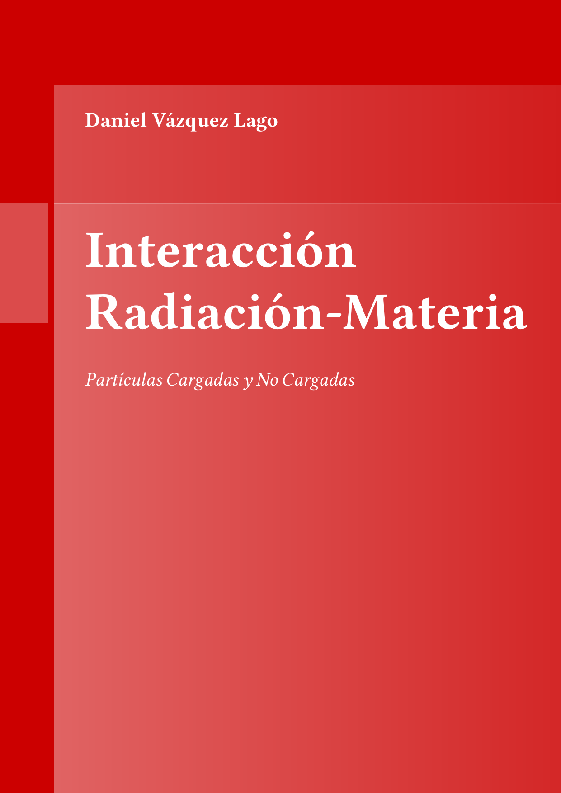
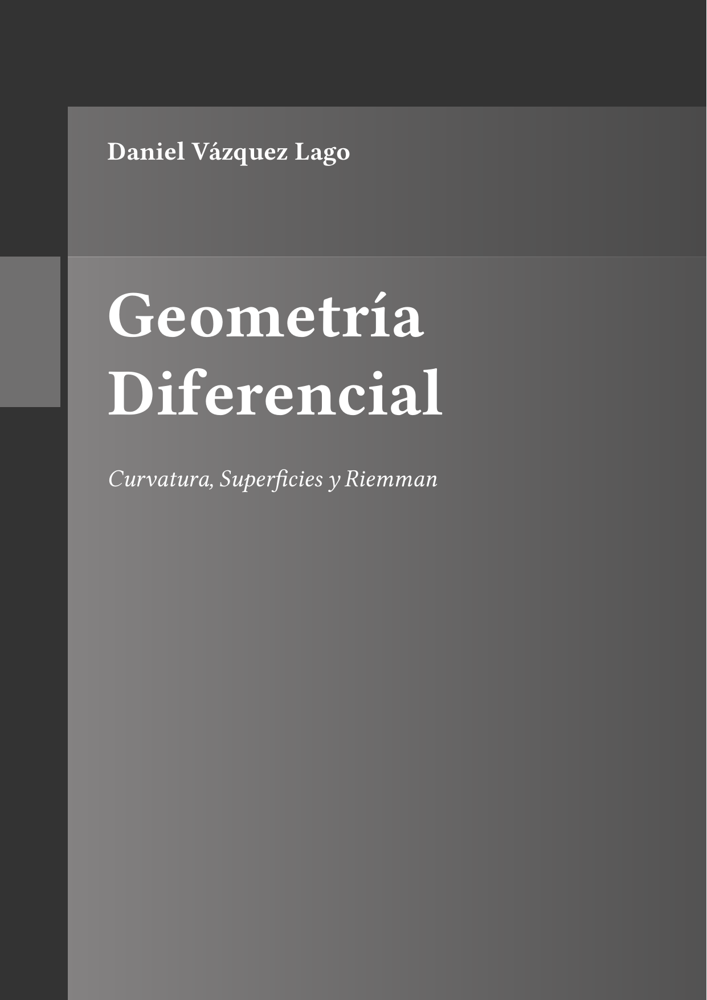
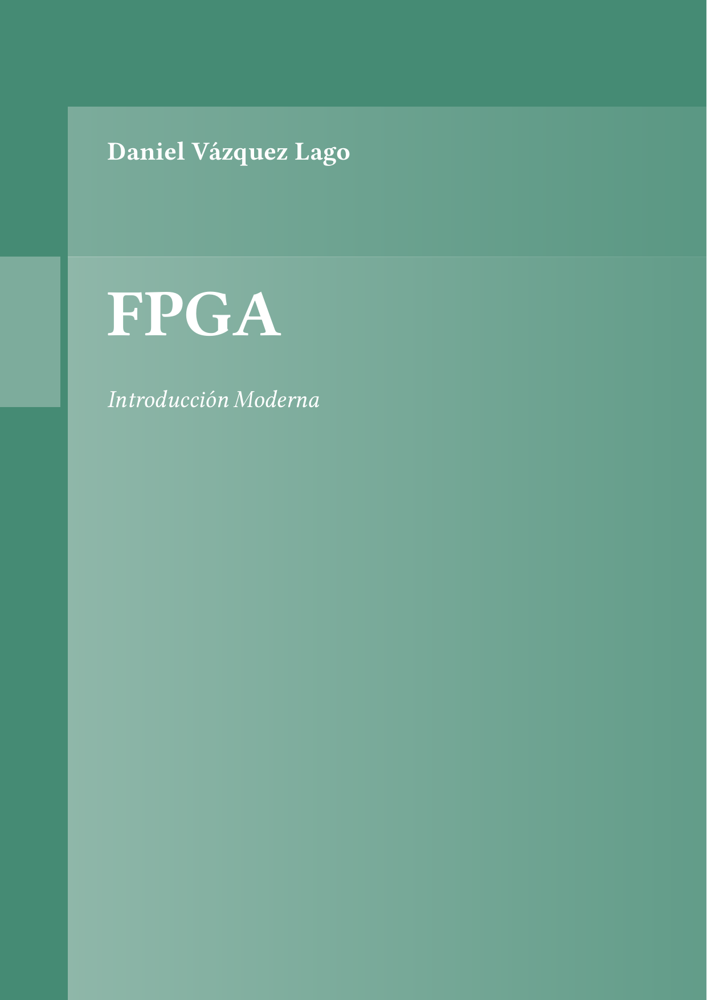
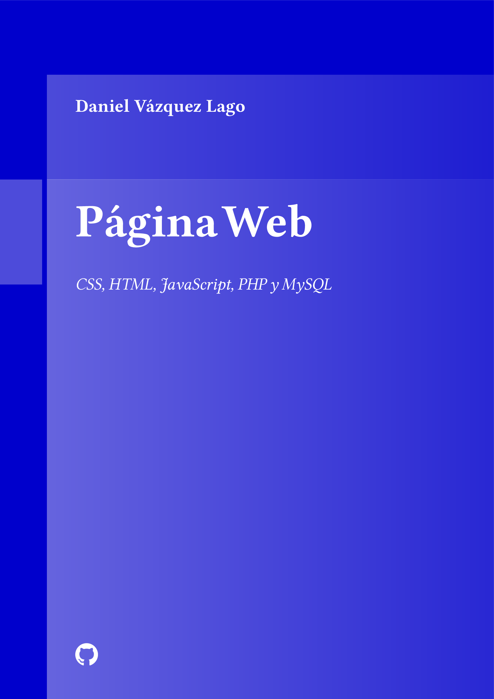

# Participación 

Para participar en el proyecto puedes contactar a mi correo danielvazquezlago@gmail.com

# Índice de Contenidos

1. [Proyecto](#Proyecto-Cuadernos)
2. [Estructura](#Estructura)
3. [Plantilla](#Plantilla)
  - 1. [Portada](##Portada)
  - 2. [Índice](##Índice)
  - 3. [Entornos](##Macros)

# Proyecto Cuadernos

Además de promover la creación de apuntes y estudio de diferentes temas científicos (relacionado con la física, matemáticas, ingeniería y programación, entre otros), este repositorio lanza una plantilla para libros de LaTeX en español, de tal modo que encontraremos una plantilla sólida sobre la que poder trabajar incluso fuera de este repositorio. Para aquellos participantes ofrece una sólida base para el trabajo de LaTeX con VSCode y Lualatex, que con los macros copy_pdf y move_pdf permite eliminar los archivo residuales (.log, .aux...) en los 3 grandes sistemas operativos, a saber, Windows, MacIOS y Linux. De esta manera no pone límites al usuario, permitiéndo una experiencia cómoda y sin necesidad de mover los pdfs de posición. 

# Estructura

La estructura es sencilla. Tenemos una carpeta donde se almacenan todos las macros de interés (Índice, Portada, y Entornos). En el apartado de entornos tenemos definidos lo que son las estructuras de Teorema, Definición, Ejercicio, Ejemplo y Resalte. Luego además tenemos la carpeta donde se almacenan los pdfs de todas las asignaturas automáticamente cuando se ejecuta el archivo .tex de una asignatura.

  - [PDFs](https://github.com/Godanitt/Cuadernos/tree/main/_Pdf)

Luego tenemos 4 carpetas de Cuadernos: Física, Matemáticas, Ingeniería y Programación, donde se colocarán los diferentes temas. Por cada una de estas tendremos varias. Entre las más destacadas tenemos: 

  -  [Física](https://github.com/Godanitt/Cuadernos/tree/main/Fisica):
      - [Astrofísica](https://github.com/Godanitt/Cuadernos/tree/main/Fisica/Astrofisica)
      - [Interaccion Radiacion Materia](https://github.com/Godanitt/Cuadernos/tree/main/Fisica/InteraccionRadiacionMateria)
      - [Teoría Cuántica de Campos (TCC)](https://github.com/Godanitt/Cuadernos/tree/main/Fisica/TCC)
      - [Física de Partículas](https://github.com/Godanitt/Cuadernos/tree/main/Fisica/Particulas)
      - [Electrodinámica](https://github.com/Godanitt/Cuadernos/tree/main/Fisica/Electrodinámica)
  - [Ingeniería](https://github.com/Godanitt/Cuadernos/tree/main/Ingenieria): 
    - [FPGA](https://github.com/Godanitt/Cuadernos/tree/main/Ingenieria/FPGA)
    - [Diseño Lógico](https://github.com/Godanitt/Cuadernos/tree/main/Ingenieria/Dise%C3%B1o%20Logico)
  - [Matemáticas](https://github.com/Godanitt/Cuadernos/tree/main/Ingenieria):
    - [Geometria Diferencial](https://github.com/Godanitt/Cuadernos/tree/main/Matematicas/Geometria_Diferencial)
    - [Algebra](https://github.com/Godanitt/Cuadernos/tree/main/Matematicas/Algebra)
    - [Métodos Numéricos para el cálculo](https://github.com/Godanitt/Cuadernos/tree/main/Matematicas/Metodos_Numericos)
  - [Programación](https://github.com/Godanitt/Cuadernos/tree/main/Ingenieria): 
    - [Deep Learning](https://github.com/Godanitt/Cuadernos/tree/main/Programacion/Deep%20Learning)
    - [Página Web (css, html, php & mysql)](https://github.com/Godanitt/Cuadernos/tree/main/Programacion/Pagina%20Web)
    - [Linux](https://github.com/Godanitt/Cuadernos/tree/main/Programacion/Linux)
    - [Python](https://github.com/Godanitt/Cuadernos/Python)
    - [Simulacion en Fisica de Partículas (geant4, garfield++, root)](https://github.com/Godanitt/Cuadernos/Particle_Simulation)

# Plantilla

La plantilla trata de ser lo más sencilla posible, de tal modo que cualquiera pueda usarla. Cabe destacar que para poder disfrutar de todas las ventajas es necesario usar Latex en VSCode, aunque la ejecucción de los archivos .tex debería funcionar en cualquier entorno y terminal. Veamos cuales son los principales entornos: 

- `Template.cls` - Clase de LaTeX. Contiene la importación de paquetes, la configuración de estilos (fancy, geometry, siunitx, hipervículos y listigs) y creación de comandos propios. 

- `Bibliografía.bib` - Archivo que contiene todas las referencias de todos los cuadernos, para su posible reuso. 
- `0_Macros` - Carpeta que contiene: 
  - `Entornos.tex` - Se definen aquí los entornos Ejercicio, Teorema, Definición, Ejemplo y Resalte.
  - `Indice.tex` - Se define aquí como debe ser el índice y el comando `\NewPart`, que permite la aparición en el índice de una separación al modo de `\Part` en la clase book normal pero de manera más elegante.
  - `Titulo.tex` - Se define aquí las características del título, así como diferentes estílos del mismo. 

## Portada

Las portadas tiene un color definido para cada archivo (aunque se puede cambiar en la entrada de cada archivo). Veamos algunos ejemplos: 

<table>
  <tr>
    <td align="center">
      <strong style="font-size: 26px;"> Física </strong> 
        
      </a>
    </td>
    <td align="center">
      <strong style="font-size: 26px;">Matemáticas</strong> 
        
      </a>
    </td>
  </tr>
  <tr>
    <td align="center">
      <strong style="font-size: 26px;"> Ingeniería </strong> 
        
      </a>
    </td>
    <td align="center">
      <strong style="font-size: 26px;"> Programación </strong> 
        
      </a>
    </td>
    <td align="center">
      <strong style="font-size: 26px;"> Química </strong> 
        
      </a>
    </td>
  </tr>
</table>

## Índice

## Macros 
