# Cuadernos

> Biblioteca abierta de cuadernos extensos de ciencias, ingeniería, humanidades y ciencias sociales, desarrollados en Typst y organizados como volúmenes conectados.

[](https://typst.app/)


## Estado general

| Cuadernos | Activos | PDF disponibles | PDF actualizados | Capítulos | Páginas compiladas | Progreso editorial |
|---:|---:|---:|---:|---:|---:|---:|
| **80** | **39** | **80** | **80** | **982** | **2864** | **5%** |

El porcentaje editorial se calcula automáticamente a partir del contenido Typst, figuras, ejercicios, referencias y estado de revisión. Puede cambiarse a modo manual dentro del bloque `notebook` del archivo principal Typst.

## Inicio rápido

### Requisitos

- Python 3.11 o posterior.
- Tinymist CLI disponible en `PATH`, en `TINYMIST_BIN` o dentro de una instalación habitual de la extensión de VS Code.
- Poppler (`pdfinfo` y `pdftoppm`) para contabilizar páginas y generar previsualizaciones.

### Un único comando

```bash
python run_all.py
```

Este comando descubre los archivos principales Typst, lee su bloque `notebook`, valida el proyecto, compila únicamente lo modificado con Tinymist, actualiza `tinymist.lock` y reconstruye el README y los catálogos.

También puede limitarse la compilación:

```bash
python -m cuadernos update Fis-Electrodinamica
python -m cuadernos update Medicina
python -m cuadernos update --force
python -m cuadernos update --rebuild-lock  # reparar o reconstruir todas las rutas
```

Para actualizar el catálogo sin compilar:

```bash
python -m cuadernos update --no-build
```

Para añadir un cuaderno basta con copiar una carpeta existente, renombrar su archivo principal y editar el bloque `notebook` situado al comienzo. No hay manifiestos ni comandos de alta.

Mientras editas, puedes ejecutar `python -m cuadernos watch` para releer automáticamente los mains y actualizar el catálogo al guardar.

La configuración `.vscode/settings.json` activa `lockDatabase`. Al abrir cualquier capítulo, Tinymist usa el documento principal registrado en `tinymist.lock`, evitando falsos avisos de etiquetas inexistentes.

## Catálogo

**Estados:** ⚪ Planificado · 🟤 Esqueleto · 🟡 En desarrollo · 🔵 Utilizable · 🟢 Estable · ⏸️ Pausado.

### Física

| Portada | Cuaderno | Estado y métricas | Partes |
|:---:|---|---|---|
|  | **[Fis-Astrofisica · Astrofísica y Cosmología](cuadernos/Fisica/Astrofisica/)**<br>Cuaderno organizado en 3 partes y 3 capítulos activos. | 🟤 **Esqueleto**<br>`░░░░░░░░░░` **5 %**<br>3 capítulos · 17 páginas<br>[PDF](pdf/Fis-Astrofisica.pdf) · [Fuente](cuadernos/Fisica/Astrofisica/) | <strong>Astrofísica Nuclear</strong> <sub>(1 cap.)</sub><br><strong>Nucleosíntesis Estelar y Primordial</strong> <sub>(2 cap.)</sub><br><strong>Cosmología</strong> <sub>(0 cap.)</sub> |
|  | **[Fis-Atomica · Física Atómica y Molecular](cuadernos/Fisica/Atomica_Molecular/)**<br>Esquema editorial organizado en 6 partes; el desarrollo del texto está en fase inicial. | 🟤 **Esqueleto**<br>`░░░░░░░░░░` **1 %**<br>24 capítulos · 63 páginas<br>[PDF](pdf/Fis-Atomica.pdf) · [Fuente](cuadernos/Fisica/Atomica_Molecular/) | <strong>Estructura atómica</strong> <sub>(4 cap.)</sub><br><strong>Interacción radiación-materia</strong> <sub>(4 cap.)</sub><br><strong>Física molecular</strong> <sub>(4 cap.)</sub><br><strong>Espectroscopia</strong> <sub>(4 cap.)</sub><br><strong>Colisiones y materia fría</strong> <sub>(4 cap.)</sub><br><strong>Aplicaciones y métodos experimentales</strong> <sub>(4 cap.)</sub> |
|  | **[Fis-Cuantica · Física Cuántica](cuadernos/Fisica/Fisica_Cuantica/)**<br>Esquema editorial organizado en 7 partes; el desarrollo del texto está en fase inicial. | 🟤 **Esqueleto**<br>`░░░░░░░░░░` **1 %**<br>28 capítulos · 73 páginas<br>[PDF](pdf/Fis-Cuantica.pdf) · [Fuente](cuadernos/Fisica/Fisica_Cuantica/) | <strong>Fundamentos de la teoría cuántica</strong> <sub>(4 cap.)</sub><br><strong>Dinámica cuántica</strong> <sub>(4 cap.)</sub><br><strong>Sistemas elementales</strong> <sub>(4 cap.)</sub><br><strong>Métodos de aproximación</strong> <sub>(4 cap.)</sub><br><strong>Sistemas compuestos y partículas idénticas</strong> <sub>(4 cap.)</sub><br><strong>Sistemas abiertos e información cuántica</strong> <sub>(4 cap.)</sub><br><strong>Tecnologías cuánticas</strong> <sub>(4 cap.)</sub> |
|  | **[Fis-DetectoresParticulas · Detectores en Física Nuclear y Partículas](cuadernos/Fisica/Detectores_Particulas/)**<br>Cuaderno organizado en 7 partes y 11 capítulos activos. | 🟤 **Esqueleto**<br>`░░░░░░░░░░` **4 %**<br>11 capítulos · 53 páginas<br>[PDF](pdf/Fis-DetectoresParticulas.pdf) · [Fuente](cuadernos/Fisica/Detectores_Particulas/) | <strong>Interacción radiación–materia</strong> <sub>(0 cap.)</sub><br><strong>Electrónica</strong> <sub>(0 cap.)</sub><br><strong>Estadística</strong> <sub>(0 cap.)</sub><br><strong>Aceleradores</strong> <sub>(1 cap.)</sub><br><strong>Detectores</strong> <sub>(9 cap.)</sub><br><strong>Simulación en física de detectores</strong> <sub>(0 cap.)</sub><br><strong>Aplicaciones</strong> <sub>(1 cap.)</sub> |
|  | **[Fis-Electrodinamica · Electrodinámica](cuadernos/Fisica/Electrodinamica/)**<br>Cuaderno organizado en 5 partes y 16 capítulos activos. | 🟤 **Esqueleto**<br>`░░░░░░░░░░` **2 %**<br>16 capítulos · 45 páginas<br>[PDF](pdf/Fis-Electrodinamica.pdf) · [Fuente](cuadernos/Fisica/Electrodinamica/) | <strong>Contenido</strong> <sub>(1 cap.)</sub><br><strong>Electrostática</strong> <sub>(3 cap.)</sub><br><strong>Magnetostática</strong> <sub>(3 cap.)</sub><br><strong>Electrodinámica</strong> <sub>(6 cap.)</sub><br><strong>Radiación</strong> <sub>(3 cap.)</sub> |
|  | **[Fis-Estado_Solido · Física del Estado Sólido](cuadernos/Fisica/Estado_Solido/)**<br>Esquema editorial organizado en 7 partes; el desarrollo del texto está en fase inicial. | 🟤 **Esqueleto**<br>`░░░░░░░░░░` **1 %**<br>28 capítulos · 73 páginas<br>[PDF](pdf/Fis-Estado_Solido.pdf) · [Fuente](cuadernos/Fisica/Estado_Solido/) | <strong>Estructura cristalina</strong> <sub>(4 cap.)</sub><br><strong>Electrones en sólidos</strong> <sub>(4 cap.)</sub><br><strong>Dinámica de la red</strong> <sub>(4 cap.)</sub><br><strong>Transporte electrónico</strong> <sub>(4 cap.)</sub><br><strong>Magnetismo</strong> <sub>(4 cap.)</sub><br><strong>Superconductividad</strong> <sub>(4 cap.)</sub><br><strong>Materia condensada avanzada</strong> <sub>(4 cap.)</sub> |
|  | **[Fis-Fisica_Medica · Física Médica](cuadernos/Fisica/Fisica_Medica/)**<br>Cuaderno planificado con 6 partes previstas. | ⚪ **Planificado**<br>`░░░░░░░░░░` **5 %**<br>1 capítulo · 7 páginas<br>[PDF](pdf/Fis-Fisica_Medica.pdf) · [Fuente](cuadernos/Fisica/Fisica_Medica/) | <strong>Interacción de la radiación con la materia</strong> <sub>(1 cap.)</sub> |
| 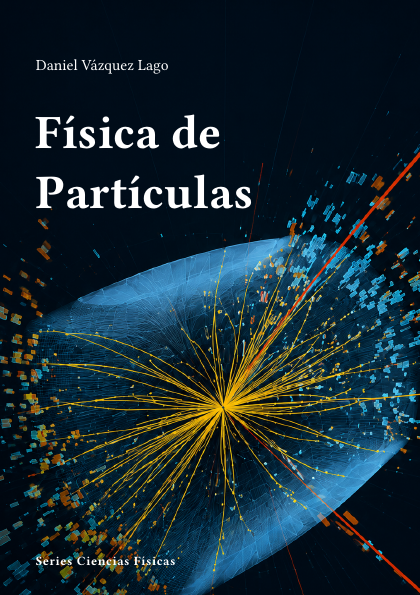 | **[Fis-Fisica_Particulas · Física de Partículas](cuadernos/Fisica/Fisica_Particulas/)**<br>Esquema editorial organizado en 8 partes; el desarrollo del texto está en fase inicial. | 🟤 **Esqueleto**<br>`░░░░░░░░░░` **1 %**<br>32 capítulos · 85 páginas<br>[PDF](pdf/Fis-Fisica_Particulas.pdf) · [Fuente](cuadernos/Fisica/Fisica_Particulas/) | <strong>Fundamentos y simetrías</strong> <sub>(4 cap.)</sub><br><strong>Mecánica cuántica relativista</strong> <sub>(4 cap.)</sub><br><strong>Campos clásicos</strong> <sub>(4 cap.)</sub><br><strong>Teoría cuántica de campos</strong> <sub>(4 cap.)</sub><br><strong>Teorías gauge y modelo estándar</strong> <sub>(4 cap.)</sub><br><strong>Fenomenología de partículas</strong> <sub>(4 cap.)</sub><br><strong>Más allá del modelo estándar</strong> <sub>(4 cap.)</sub><br><strong>Astropartículas y cosmología de partículas</strong> <sub>(4 cap.)</sub> |
|  | **[Fis-FisicaPlasma · Física del Plasma](cuadernos/Fisica/Fisica_Plasma/)**<br>Esquema editorial organizado en 8 partes; el desarrollo del texto está en fase inicial. | 🟤 **Esqueleto**<br>`░░░░░░░░░░` **1 %**<br>32 capítulos · 85 páginas<br>[PDF](pdf/Fis-FisicaPlasma.pdf) · [Fuente](cuadernos/Fisica/Fisica_Plasma/) | <strong>Fundamentos del plasma</strong> <sub>(4 cap.)</sub><br><strong>Movimiento de partículas</strong> <sub>(4 cap.)</sub><br><strong>Teoría cinética</strong> <sub>(4 cap.)</sub><br><strong>Descripción fluida y MHD</strong> <sub>(4 cap.)</sub><br><strong>Ondas e inestabilidades</strong> <sub>(4 cap.)</sub><br><strong>Plasmas fríos y descargas</strong> <sub>(4 cap.)</sub><br><strong>Fusión y confinamiento</strong> <sub>(4 cap.)</sub><br><strong>Plasmas espaciales y astrofísicos</strong> <sub>(4 cap.)</sub> |
|  | **[Fis-Fluidos · Física de Fluidos](cuadernos/Fisica/Fisica_Fluidos/)**<br>Esquema editorial organizado en 7 partes; el desarrollo del texto está en fase inicial. | 🟤 **Esqueleto**<br>`░░░░░░░░░░` **1 %**<br>28 capítulos · 73 páginas<br>[PDF](pdf/Fis-Fluidos.pdf) · [Fuente](cuadernos/Fisica/Fisica_Fluidos/) | <strong>Fundamentos de medios continuos</strong> <sub>(4 cap.)</sub><br><strong>Fluidos ideales</strong> <sub>(4 cap.)</sub><br><strong>Fluidos viscosos</strong> <sub>(4 cap.)</sub><br><strong>Capas límite y aerodinámica</strong> <sub>(4 cap.)</sub><br><strong>Turbulencia</strong> <sub>(4 cap.)</sub><br><strong>Flujos compresibles</strong> <sub>(4 cap.)</sub><br><strong>Fluidos multifásicos y geofísicos</strong> <sub>(4 cap.)</sub> |
|  | **[Fis-Gravitacion · Gravitación](cuadernos/Fisica/Gravitacion/)**<br>Esquema editorial organizado en 7 partes; el desarrollo del texto está en fase inicial. | 🟤 **Esqueleto**<br>`░░░░░░░░░░` **1 %**<br>28 capítulos · 73 páginas<br>[PDF](pdf/Fis-Gravitacion.pdf) · [Fuente](cuadernos/Fisica/Gravitacion/) | <strong>Relatividad especial</strong> <sub>(4 cap.)</sub><br><strong>Geometría del espacio-tiempo</strong> <sub>(4 cap.)</sub><br><strong>Relatividad general</strong> <sub>(4 cap.)</sub><br><strong>Soluciones y objetos compactos</strong> <sub>(4 cap.)</sub><br><strong>Ondas gravitacionales</strong> <sub>(4 cap.)</sub><br><strong>Cosmología relativista</strong> <sub>(4 cap.)</sub><br><strong>Gravedad avanzada</strong> <sub>(4 cap.)</sub> |
| 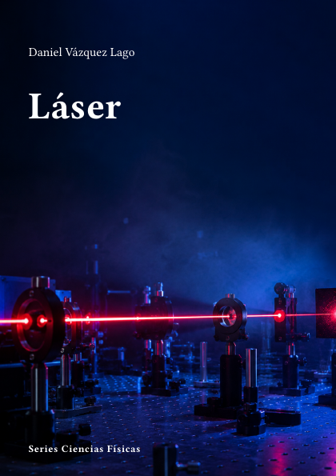 | **[Fis-Laser · Láser](cuadernos/Fisica/Laser/)**<br>Esquema editorial organizado en 6 partes; el desarrollo del texto está en fase inicial. | 🟤 **Esqueleto**<br>`░░░░░░░░░░` **1 %**<br>24 capítulos · 63 páginas<br>[PDF](pdf/Fis-Laser.pdf) · [Fuente](cuadernos/Fisica/Laser/) | <strong>Interacción luz-materia</strong> <sub>(4 cap.)</sub><br><strong>Resonadores ópticos</strong> <sub>(4 cap.)</sub><br><strong>Dinámica del láser</strong> <sub>(4 cap.)</sub><br><strong>Tipos de láser</strong> <sub>(4 cap.)</sub><br><strong>Pulsos ultracortos</strong> <sub>(4 cap.)</sub><br><strong>Aplicaciones</strong> <sub>(4 cap.)</sub> |
|  | **[Fis-Mecanica_Clasica · Mecánica Clásica](cuadernos/Fisica/Mecanica_Clasica/)**<br>Esquema editorial organizado en 6 partes; el desarrollo del texto está en fase inicial. | 🟤 **Esqueleto**<br>`░░░░░░░░░░` **1 %**<br>22 capítulos · 59 páginas<br>[PDF](pdf/Fis-Mecanica_Clasica.pdf) · [Fuente](cuadernos/Fisica/Mecanica_Clasica/) | <strong>Fundamentos de la mecánica</strong> <sub>(3 cap.)</sub><br><strong>Mecánica analítica</strong> <sub>(4 cap.)</sub><br><strong>Mecánica hamiltoniana</strong> <sub>(4 cap.)</sub><br><strong>Sistemas de muchas partículas y sólidos rígidos</strong> <sub>(3 cap.)</sub><br><strong>Oscilaciones, ondas y medios continuos</strong> <sub>(4 cap.)</sub><br><strong>Dinámica no lineal y caos</strong> <sub>(4 cap.)</sub> |
|  | **[Fis-Nuclear · Física Nuclear](cuadernos/Fisica/Fisica_Nuclear/)**<br>Esquema editorial organizado en 7 partes; el desarrollo del texto está en fase inicial. | 🟤 **Esqueleto**<br>`░░░░░░░░░░` **1 %**<br>28 capítulos · 73 páginas<br>[PDF](pdf/Fis-Nuclear.pdf) · [Fuente](cuadernos/Fisica/Fisica_Nuclear/) | <strong>Propiedades del núcleo</strong> <sub>(4 cap.)</sub><br><strong>Modelos nucleares</strong> <sub>(4 cap.)</sub><br><strong>Desintegraciones radiactivas</strong> <sub>(4 cap.)</sub><br><strong>Reacciones nucleares</strong> <sub>(4 cap.)</sub><br><strong>Fisión y fusión</strong> <sub>(4 cap.)</sub><br><strong>Astrofísica nuclear</strong> <sub>(4 cap.)</sub><br><strong>Aplicaciones</strong> <sub>(4 cap.)</sub> |
| 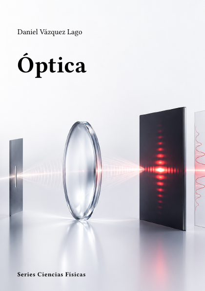 | **[Fis-Optica · Óptica](cuadernos/Fisica/Optica/)**<br>Esquema editorial organizado en 7 partes; el desarrollo del texto está en fase inicial. | 🟤 **Esqueleto**<br>`░░░░░░░░░░` **1 %**<br>28 capítulos · 73 páginas<br>[PDF](pdf/Fis-Optica.pdf) · [Fuente](cuadernos/Fisica/Optica/) | <strong>Óptica geométrica</strong> <sub>(4 cap.)</sub><br><strong>Óptica ondulatoria</strong> <sub>(4 cap.)</sub><br><strong>Coherencia y Fourier</strong> <sub>(4 cap.)</sub><br><strong>Instrumentación óptica</strong> <sub>(4 cap.)</sub><br><strong>Óptica de medios</strong> <sub>(4 cap.)</sub><br><strong>Óptica no lineal</strong> <sub>(4 cap.)</sub><br><strong>Óptica cuántica</strong> <sub>(4 cap.)</sub> |
|  | **[Fis-Semiconductores · Física de Semiconductores y Electrónica](cuadernos/Fisica/Semiconductores/)**<br>Esquema editorial organizado en 6 partes; el desarrollo del texto está en fase inicial. | 🟤 **Esqueleto**<br>`░░░░░░░░░░` **1 %**<br>24 capítulos · 63 páginas<br>[PDF](pdf/Fis-Semiconductores.pdf) · [Fuente](cuadernos/Fisica/Semiconductores/) | <strong>Fundamentos de semiconductores</strong> <sub>(4 cap.)</sub><br><strong>Uniones y contactos</strong> <sub>(4 cap.)</sub><br><strong>Transistores</strong> <sub>(4 cap.)</sub><br><strong>Optoelectrónica</strong> <sub>(4 cap.)</sub><br><strong>Fabricación y caracterización</strong> <sub>(4 cap.)</sub><br><strong>Nanoelectrónica y dispositivos avanzados</strong> <sub>(4 cap.)</sub> |
| 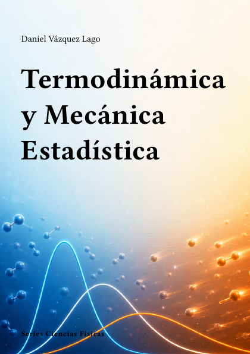 | **[Fis-Termodinamica · Termodinámica y Mecánica Estadística](cuadernos/Fisica/Termodinamica/)**<br>Esquema editorial organizado en 7 partes; el desarrollo del texto está en fase inicial. | 🟤 **Esqueleto**<br>`░░░░░░░░░░` **1 %**<br>28 capítulos · 73 páginas<br>[PDF](pdf/Fis-Termodinamica.pdf) · [Fuente](cuadernos/Fisica/Termodinamica/) | <strong>Fundamentos termodinámicos</strong> <sub>(4 cap.)</sub><br><strong>Potenciales y equilibrio</strong> <sub>(4 cap.)</sub><br><strong>Mecánica estadística clásica</strong> <sub>(4 cap.)</sub><br><strong>Estadística cuántica</strong> <sub>(4 cap.)</sub><br><strong>Transiciones de fase y fenómenos críticos</strong> <sub>(4 cap.)</sub><br><strong>Procesos irreversibles</strong> <sub>(4 cap.)</sub><br><strong>Sistemas complejos</strong> <sub>(4 cap.)</sub> |

### Matemáticas

| Portada | Cuaderno | Estado y métricas | Partes |
|:---:|---|---|---|
| 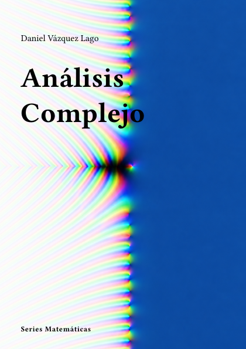 | **[Mat-AnalisisComplejo · Análisis Complejo](cuadernos/Matematicas/Analisis_Complejo/)**<br>Cuaderno en preparación. | ⚪ **Planificado**<br>`█░░░░░░░░░` **14 %**<br>1 capítulo · 9 páginas<br>[PDF](pdf/Mat-AnalisisComplejo.pdf) · [Fuente](cuadernos/Matematicas/Analisis_Complejo/) | <strong>Fundamentos</strong> <sub>(1 cap.)</sub> |
| 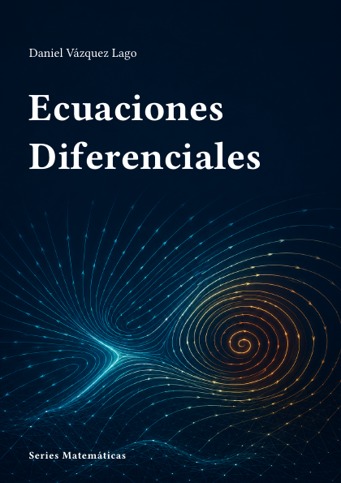 | **[Mat-Ecuaciones_Diferenciales · Ecuaciones Diferenciales](cuadernos/Matematicas/Ecuaciones_Diferenciales/)**<br>Cuaderno planificado con 6 partes previstas. | ⚪ **Planificado**<br>`░░░░░░░░░░` **5 %**<br>1 capítulo · 7 páginas<br>[PDF](pdf/Mat-Ecuaciones_Diferenciales.pdf) · [Fuente](cuadernos/Matematicas/Ecuaciones_Diferenciales/) | <strong>Ecuaciones diferenciales ordinarias de primer orden</strong> <sub>(1 cap.)</sub> |
| 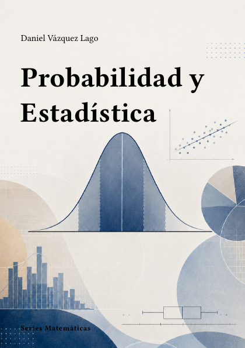 | **[Mat-Estadistica · Probabilidad y Estadística](cuadernos/Matematicas/Estadistica/)**<br>Cuaderno planificado con 6 partes previstas. | ⚪ **Planificado**<br>`░░░░░░░░░░` **5 %**<br>1 capítulo · 7 páginas<br>[PDF](pdf/Mat-Estadistica.pdf) · [Fuente](cuadernos/Matematicas/Estadistica/) | <strong>Fundamentos de probabilidad</strong> <sub>(1 cap.)</sub> |
|  | **[Mat-Geometria_Diferencial · Geometría Diferencial](cuadernos/Matematicas/Geometria_Diferencial/)**<br>Cuaderno organizado en 4 partes y 24 capítulos activos. | 🟤 **Esqueleto**<br>`█░░░░░░░░░` **7 %**<br>24 capítulos · 45 páginas<br>[PDF](pdf/Mat-Geometria_Diferencial.pdf) · [Fuente](cuadernos/Matematicas/Geometria_Diferencial/) | <strong>Variedades Diferenciales</strong> <sub>(7 cap.)</sub><br><strong>Geometría de Riemann</strong> <sub>(5 cap.)</sub><br><strong>Relatividad General</strong> <sub>(7 cap.)</sub><br><strong>Teorías de Gauge</strong> <sub>(5 cap.)</sub> |
|  | **[Mat-Metodos_Numericos · Métodos Numéricos](cuadernos/Matematicas/Metodos_Numericos/)**<br>Cuaderno planificado con 6 partes previstas. | ⚪ **Planificado**<br>`░░░░░░░░░░` **5 %**<br>1 capítulo · 7 páginas<br>[PDF](pdf/Mat-Metodos_Numericos.pdf) · [Fuente](cuadernos/Matematicas/Metodos_Numericos/) | <strong>Errores y aritmética numérica</strong> <sub>(1 cap.)</sub> |
|  | **[Mat-Teoria_Grupos · Teoría de Grupos](cuadernos/Matematicas/Teoria_Grupos/)**<br>Cuaderno organizado en 3 partes y 7 capítulos activos. | 🟡 **En desarrollo**<br>`████░░░░░░` **42 %**<br>7 capítulos · 53 páginas<br>[PDF](pdf/Mat-Teoria_Grupos.pdf) · [Fuente](cuadernos/Matematicas/Teoria_Grupos/) | <strong>Introducción y Grupos Discretos</strong> <sub>(3 cap.)</sub><br><strong>Grupos Continuos</strong> <sub>(1 cap.)</sub><br><strong>Teoría de Grupos aplicada a la física</strong> <sub>(3 cap.)</sub> |
|  | **[Mat-Transformadas_Integrales · Transformadas Integrales](cuadernos/Matematicas/Transformada_Integral/)**<br>Cuaderno planificado con 6 partes previstas. | ⚪ **Planificado**<br>`░░░░░░░░░░` **5 %**<br>1 capítulo · 7 páginas<br>[PDF](pdf/Mat-Transformadas_Integrales.pdf) · [Fuente](cuadernos/Matematicas/Transformada_Integral/) | <strong>Fundamentos de análisis integral</strong> <sub>(1 cap.)</sub> |

### Ingeniería

| Portada | Cuaderno | Estado y métricas | Partes |
|:---:|---|---|---|
|  | **[I-Aeroespacial · Ingeniería Aeroespacial y Aeronáutica](cuadernos/Ingenieria/Aeroespacial/)**<br>Esquema editorial organizado en 7 partes; el desarrollo del texto está en fase inicial. | 🟤 **Esqueleto**<br>`░░░░░░░░░░` **1 %**<br>28 capítulos · 73 páginas<br>[PDF](pdf/I-Aeroespacial.pdf) · [Fuente](cuadernos/Ingenieria/Aeroespacial/) | <strong>Aerodinámica</strong> <sub>(4 cap.)</sub><br><strong>Mecánica de vuelo</strong> <sub>(4 cap.)</sub><br><strong>Propulsión</strong> <sub>(4 cap.)</sub><br><strong>Estructuras y materiales</strong> <sub>(4 cap.)</sub><br><strong>Aviónica y sistemas</strong> <sub>(4 cap.)</sub><br><strong>Ingeniería espacial</strong> <sub>(4 cap.)</sub><br><strong>Diseño y certificación</strong> <sub>(4 cap.)</sub> |
|  | **[I-Agropecuaria · Ingeniería Agropecuaria](cuadernos/Ingenieria/Agropecuaria/)**<br>Cuaderno planificado con 6 partes previstas. | ⚪ **Planificado**<br>`░░░░░░░░░░` **5 %**<br>1 capítulo · 7 páginas<br>[PDF](pdf/I-Agropecuaria.pdf) · [Fuente](cuadernos/Ingenieria/Agropecuaria/) | <strong>Sistemas agropecuarios</strong> <sub>(1 cap.)</sub> |
|  | **[I-Alimentaria · Ingeniería Alimentaria](cuadernos/Ingenieria/Alimentaria/)**<br>Cuaderno planificado con 6 partes previstas. | ⚪ **Planificado**<br>`░░░░░░░░░░` **5 %**<br>1 capítulo · 7 páginas<br>[PDF](pdf/I-Alimentaria.pdf) · [Fuente](cuadernos/Ingenieria/Alimentaria/) | <strong>Ciencia de los alimentos</strong> <sub>(1 cap.)</sub> |
| 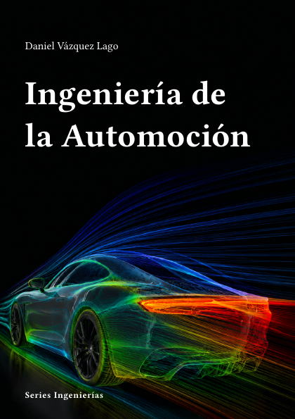 | **[I-Automocion · Ingeniería de la Automoción](cuadernos/Ingenieria/Automocion/)**<br>Esquema editorial organizado en 6 partes; el desarrollo del texto está en fase inicial. | 🟤 **Esqueleto**<br>`░░░░░░░░░░` **1 %**<br>24 capítulos · 63 páginas<br>[PDF](pdf/I-Automocion.pdf) · [Fuente](cuadernos/Ingenieria/Automocion/) | <strong>Arquitectura del vehículo</strong> <sub>(4 cap.)</sub><br><strong>Propulsión</strong> <sub>(4 cap.)</sub><br><strong>Dinámica del vehículo</strong> <sub>(4 cap.)</sub><br><strong>Estructuras y fabricación</strong> <sub>(4 cap.)</sub><br><strong>Electrónica y control</strong> <sub>(4 cap.)</sub><br><strong>Seguridad y sostenibilidad</strong> <sub>(4 cap.)</sub> |
|  | **[I-Biomedica · Ingeniería Biomédica](cuadernos/Ingenieria/Biomedica/)**<br>Esquema editorial organizado en 6 partes; el desarrollo del texto está en fase inicial. | 🟤 **Esqueleto**<br>`░░░░░░░░░░` **1 %**<br>24 capítulos · 63 páginas<br>[PDF](pdf/I-Biomedica.pdf) · [Fuente](cuadernos/Ingenieria/Biomedica/) | <strong>Fundamentos biomédicos</strong> <sub>(4 cap.)</sub><br><strong>Instrumentación biomédica</strong> <sub>(4 cap.)</sub><br><strong>Señales e imágenes médicas</strong> <sub>(4 cap.)</sub><br><strong>Dispositivos y prótesis</strong> <sub>(4 cap.)</sub><br><strong>Ingeniería clínica</strong> <sub>(4 cap.)</sub><br><strong>Regulación y diseño</strong> <sub>(4 cap.)</sub> |
|  | **[I-Biotecnologia · Ingeniería Biotecnológica](cuadernos/Ingenieria/Biotecnologia/)**<br>Esquema editorial organizado en 7 partes; el desarrollo del texto está en fase inicial. | 🟤 **Esqueleto**<br>`░░░░░░░░░░` **1 %**<br>28 capítulos · 73 páginas<br>[PDF](pdf/I-Biotecnologia.pdf) · [Fuente](cuadernos/Ingenieria/Biotecnologia/) | <strong>Biología molecular para ingeniería</strong> <sub>(4 cap.)</sub><br><strong>Ingeniería genética y sintética</strong> <sub>(4 cap.)</sub><br><strong>Bioprocesos</strong> <sub>(4 cap.)</sub><br><strong>Operaciones de separación</strong> <sub>(4 cap.)</sub><br><strong>Omicas y biología computacional</strong> <sub>(4 cap.)</sub><br><strong>Aplicaciones</strong> <sub>(4 cap.)</sub><br><strong>Calidad y regulación</strong> <sub>(4 cap.)</sub> |
|  | **[I-Ciencia_Materiales · Ciencia e Ingeniería de Materiales](cuadernos/Ingenieria/Ciencia_Materiales/)**<br>Cuaderno planificado con 6 partes previstas. | ⚪ **Planificado**<br>`░░░░░░░░░░` **5 %**<br>1 capítulo · 7 páginas<br>[PDF](pdf/I-Ciencia_Materiales.pdf) · [Fuente](cuadernos/Ingenieria/Ciencia_Materiales/) | <strong>Estructura de los materiales</strong> <sub>(1 cap.)</sub> |
|  | **[I-Electrica · Ingeniería Eléctrica](cuadernos/Ingenieria/Electrica/)**<br>Esquema editorial organizado en 6 partes; el desarrollo del texto está en fase inicial. | 🟤 **Esqueleto**<br>`░░░░░░░░░░` **1 %**<br>24 capítulos · 63 páginas<br>[PDF](pdf/I-Electrica.pdf) · [Fuente](cuadernos/Ingenieria/Electrica/) | <strong>Circuitos y electromagnetismo</strong> <sub>(4 cap.)</sub><br><strong>Máquinas eléctricas</strong> <sub>(4 cap.)</sub><br><strong>Electrónica de potencia</strong> <sub>(4 cap.)</sub><br><strong>Generación y redes</strong> <sub>(4 cap.)</sub><br><strong>Alta tensión y protecciones</strong> <sub>(4 cap.)</sub><br><strong>Sistemas eléctricos modernos</strong> <sub>(4 cap.)</sub> |
|  | **[I-Electronica · Ingeniería Electrónica](cuadernos/Ingenieria/Electronica/)**<br>Esquema editorial organizado en 6 partes; el desarrollo del texto está en fase inicial. | 🟤 **Esqueleto**<br>`░░░░░░░░░░` **1 %**<br>24 capítulos · 63 páginas<br>[PDF](pdf/I-Electronica.pdf) · [Fuente](cuadernos/Ingenieria/Electronica/) | <strong>Dispositivos electrónicos</strong> <sub>(4 cap.)</sub><br><strong>Electrónica analógica</strong> <sub>(4 cap.)</sub><br><strong>Electrónica digital</strong> <sub>(4 cap.)</sub><br><strong>Sistemas embebidos</strong> <sub>(4 cap.)</sub><br><strong>Electrónica de potencia</strong> <sub>(4 cap.)</sub><br><strong>Diseño y fabricación</strong> <sub>(4 cap.)</sub> |
|  | **[I-Energetica · Ingeniería Energética](cuadernos/Ingenieria/Energetica/)**<br>Esquema editorial organizado en 7 partes; el desarrollo del texto está en fase inicial. | 🟤 **Esqueleto**<br>`░░░░░░░░░░` **1 %**<br>28 capítulos · 73 páginas<br>[PDF](pdf/I-Energetica.pdf) · [Fuente](cuadernos/Ingenieria/Energetica/) | <strong>Fundamentos energéticos</strong> <sub>(4 cap.)</sub><br><strong>Sistemas térmicos</strong> <sub>(4 cap.)</sub><br><strong>Energías renovables</strong> <sub>(4 cap.)</sub><br><strong>Almacenamiento e hidrógeno</strong> <sub>(4 cap.)</sub><br><strong>Sistemas eléctricos y redes</strong> <sub>(4 cap.)</sub><br><strong>Energía nuclear</strong> <sub>(4 cap.)</sub><br><strong>Eficiencia y ambiente</strong> <sub>(4 cap.)</sub> |
|  | **[I-Mecanica · Ingeniería Mecánica](cuadernos/Ingenieria/Mecanica/)**<br>Esquema editorial organizado en 7 partes; el desarrollo del texto está en fase inicial. | 🟤 **Esqueleto**<br>`░░░░░░░░░░` **1 %**<br>28 capítulos · 73 páginas<br>[PDF](pdf/I-Mecanica.pdf) · [Fuente](cuadernos/Ingenieria/Mecanica/) | <strong>Mecánica y materiales</strong> <sub>(4 cap.)</sub><br><strong>Diseño mecánico</strong> <sub>(4 cap.)</sub><br><strong>Máquinas y vibraciones</strong> <sub>(4 cap.)</sub><br><strong>Sistemas térmicos y fluidos</strong> <sub>(4 cap.)</sub><br><strong>Fabricación</strong> <sub>(4 cap.)</sub><br><strong>Mecatrónica y control</strong> <sub>(4 cap.)</sub><br><strong>Fiabilidad y proyecto</strong> <sub>(4 cap.)</sub> |
|  | **[I-Militar · Ingeniería Militar](cuadernos/Ingenieria/Militar/)**<br>Esquema editorial organizado en 6 partes; el desarrollo del texto está en fase inicial. | 🟤 **Esqueleto**<br>`░░░░░░░░░░` **1 %**<br>24 capítulos · 63 páginas<br>[PDF](pdf/I-Militar.pdf) · [Fuente](cuadernos/Ingenieria/Militar/) | <strong>Ingeniería de sistemas de defensa</strong> <sub>(4 cap.)</sub><br><strong>Infraestructuras y movilidad</strong> <sub>(4 cap.)</sub><br><strong>Sensores, comunicaciones y mando</strong> <sub>(4 cap.)</sub><br><strong>Plataformas y protección</strong> <sub>(4 cap.)</sub><br><strong>Logística y operaciones</strong> <sub>(4 cap.)</sub><br><strong>Seguridad y resiliencia</strong> <sub>(4 cap.)</sub> |
|  | **[I-Minas · Ingeniería de Minas](cuadernos/Ingenieria/Minas/)**<br>Esquema editorial organizado en 7 partes; el desarrollo del texto está en fase inicial. | 🟤 **Esqueleto**<br>`░░░░░░░░░░` **1 %**<br>28 capítulos · 73 páginas<br>[PDF](pdf/I-Minas.pdf) · [Fuente](cuadernos/Ingenieria/Minas/) | <strong>Geología y exploración</strong> <sub>(4 cap.)</sub><br><strong>Explotación minera</strong> <sub>(4 cap.)</sub><br><strong>Mecánica de rocas</strong> <sub>(4 cap.)</sub><br><strong>Ventilación y servicios</strong> <sub>(4 cap.)</sub><br><strong>Procesamiento de minerales</strong> <sub>(4 cap.)</sub><br><strong>Seguridad y medio ambiente</strong> <sub>(4 cap.)</sub><br><strong>Economía y gestión</strong> <sub>(4 cap.)</sub> |
|  | **[I-Naval · Ingeniería Naval](cuadernos/Ingenieria/Naval/)**<br>Esquema editorial organizado en 7 partes; el desarrollo del texto está en fase inicial. | 🟤 **Esqueleto**<br>`░░░░░░░░░░` **1 %**<br>28 capítulos · 73 páginas<br>[PDF](pdf/I-Naval.pdf) · [Fuente](cuadernos/Ingenieria/Naval/) | <strong>Hidrostática y estabilidad</strong> <sub>(4 cap.)</sub><br><strong>Hidrodinámica naval</strong> <sub>(4 cap.)</sub><br><strong>Estructuras navales</strong> <sub>(4 cap.)</sub><br><strong>Propulsión y energía</strong> <sub>(4 cap.)</sub><br><strong>Sistemas del buque</strong> <sub>(4 cap.)</sub><br><strong>Construcción y proyecto</strong> <sub>(4 cap.)</sub><br><strong>Ingeniería oceánica</strong> <sub>(4 cap.)</sub> |
|  | **[I-Sensores · Sensores e Instrumentación](cuadernos/Ingenieria/Sensores_Instrumentacion/)**<br>Esquema editorial organizado en 6 partes; el desarrollo del texto está en fase inicial. | 🟤 **Esqueleto**<br>`░░░░░░░░░░` **1 %**<br>24 capítulos · 63 páginas<br>[PDF](pdf/I-Sensores.pdf) · [Fuente](cuadernos/Ingenieria/Sensores_Instrumentacion/) | <strong>Ciencia de la medida</strong> <sub>(4 cap.)</sub><br><strong>Sensores físicos</strong> <sub>(4 cap.)</sub><br><strong>Sensores químicos y biológicos</strong> <sub>(4 cap.)</sub><br><strong>Acondicionamiento de señal</strong> <sub>(4 cap.)</sub><br><strong>Adquisición e instrumentación</strong> <sub>(4 cap.)</sub><br><strong>Integración y aplicaciones</strong> <sub>(4 cap.)</sub> |
|  | **[I-Teleco · Ingeniería de Teleco](cuadernos/Ingenieria/Telecomunicaciones/)**<br>Esquema editorial organizado en 7 partes; el desarrollo del texto está en fase inicial. | 🟤 **Esqueleto**<br>`░░░░░░░░░░` **1 %**<br>28 capítulos · 73 páginas<br>[PDF](pdf/I-Teleco.pdf) · [Fuente](cuadernos/Ingenieria/Telecomunicaciones/) | <strong>Señales y sistemas</strong> <sub>(4 cap.)</sub><br><strong>Comunicaciones analógicas y digitales</strong> <sub>(4 cap.)</sub><br><strong>Información y codificación</strong> <sub>(4 cap.)</sub><br><strong>Radiofrecuencia y microondas</strong> <sub>(4 cap.)</sub><br><strong>Antenas y propagación</strong> <sub>(4 cap.)</sub><br><strong>Comunicaciones ópticas</strong> <sub>(4 cap.)</sub><br><strong>Redes y sistemas modernos</strong> <sub>(4 cap.)</sub> |

### Arquitectura

| Portada | Cuaderno | Estado y métricas | Partes |
|:---:|---|---|---|
|  | **[Arq-Arquitectura · Arquitectura](cuadernos/Arquitectura/Arquitectura/)**<br>Cuaderno planificado con 6 partes previstas. | ⚪ **Planificado**<br>`░░░░░░░░░░` **5 %**<br>1 capítulo · 7 páginas<br>[PDF](pdf/Arq-Arquitectura.pdf) · [Fuente](cuadernos/Arquitectura/Arquitectura/) | <strong>Fundamentos del proyecto arquitectónico</strong> <sub>(1 cap.)</sub> |

### Química

| Portada | Cuaderno | Estado y métricas | Partes |
|:---:|---|---|---|
|  | **[Q-Bioquimica · Bioquímica](cuadernos/Quimica/Bioquimica/)**<br>Cuaderno planificado con 6 partes previstas. | ⚪ **Planificado**<br>`░░░░░░░░░░` **5 %**<br>1 capítulo · 7 páginas<br>[PDF](pdf/Q-Bioquimica.pdf) · [Fuente](cuadernos/Quimica/Bioquimica/) | <strong>Estructura de biomoléculas</strong> <sub>(1 cap.)</sub> |
|  | **[Q-Ingenieria_Quimica · Ingeniería Química](cuadernos/Quimica/Ingenieria_Quimica/)**<br>Cuaderno desarrollado de ingeniería química con balances, transporte y operaciones de separación. | 🟡 **En desarrollo**<br>`██████░░░░` **57 %**<br>6 capítulos · 61 páginas<br>[PDF](pdf/Q-Ingenieria_Quimica.pdf) · [Fuente](cuadernos/Quimica/Ingenieria_Quimica/) | <strong>Fundamentos y balances</strong> <sub>(3 cap.)</sub><br><strong>Fenómenos de transporte</strong> <sub>(2 cap.)</sub><br><strong>Operaciones de separación</strong> <sub>(1 cap.)</sub><br><strong>Diseño, control y seguridad de procesos</strong> <sub>(0 cap.)</sub> |
| 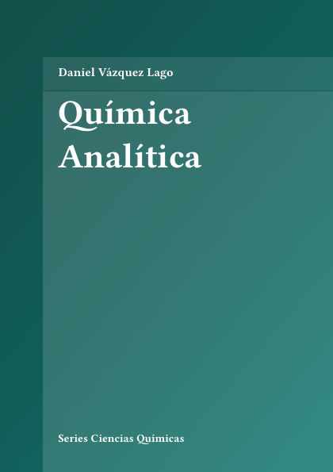 | **[Q-Quimica_Analitica · Química Analítica](cuadernos/Quimica/Quimica_Analitica/)**<br>Cuaderno planificado con 6 partes previstas. | ⚪ **Planificado**<br>`░░░░░░░░░░` **5 %**<br>1 capítulo · 7 páginas<br>[PDF](pdf/Q-Quimica_Analitica.pdf) · [Fuente](cuadernos/Quimica/Quimica_Analitica/) | <strong>Fundamentos del análisis químico</strong> <sub>(1 cap.)</sub> |
|  | **[Q-Quimica_Computacional · Química Computacional](cuadernos/Quimica/Quimica_Computacional/)**<br>Cuaderno planificado con 6 partes previstas. | ⚪ **Planificado**<br>`░░░░░░░░░░` **5 %**<br>1 capítulo · 7 páginas<br>[PDF](pdf/Q-Quimica_Computacional.pdf) · [Fuente](cuadernos/Quimica/Quimica_Computacional/) | <strong>Mecánica cuántica molecular</strong> <sub>(1 cap.)</sub> |
|  | **[Q-Quimica_Inorganica · Química Inorgánica](cuadernos/Quimica/Quimica_Inorganica/)**<br>Cuaderno planificado con 6 partes previstas. | ⚪ **Planificado**<br>`░░░░░░░░░░` **5 %**<br>1 capítulo · 7 páginas<br>[PDF](pdf/Q-Quimica_Inorganica.pdf) · [Fuente](cuadernos/Quimica/Quimica_Inorganica/) | <strong>Estructura y enlace inorgánico</strong> <sub>(1 cap.)</sub> |
|  | **[Q-Quimica_Organica · Química Orgánica](cuadernos/Quimica/Quimica_Organica/)**<br>Cuaderno planificado con 7 partes previstas. | ⚪ **Planificado**<br>`░░░░░░░░░░` **4 %**<br>1 capítulo · 7 páginas<br>[PDF](pdf/Q-Quimica_Organica.pdf) · [Fuente](cuadernos/Quimica/Quimica_Organica/) | <strong>Fundamentos</strong> <sub>(1 cap.)</sub> |

### Biología

| Portada | Cuaderno | Estado y métricas | Partes |
|:---:|---|---|---|
|  | **[Bio-Biofisica · Biofísica](cuadernos/Biologia/Biofisica/)**<br>Cuaderno planificado con 6 partes previstas. | ⚪ **Planificado**<br>`░░░░░░░░░░` **5 %**<br>1 capítulo · 7 páginas<br>[PDF](pdf/Bio-Biofisica.pdf) · [Fuente](cuadernos/Biologia/Biofisica/) | <strong>Fundamentos físicos de los sistemas biológicos</strong> <sub>(1 cap.)</sub> |
|  | **[Bio-Biologia_Celular_Molecular · Biología Celular y Molecular](cuadernos/Biologia/Biologia_Celular_Molecular/)**<br>Cuaderno planificado con 6 partes previstas. | ⚪ **Planificado**<br>`░░░░░░░░░░` **5 %**<br>1 capítulo · 7 páginas<br>[PDF](pdf/Bio-Biologia_Celular_Molecular.pdf) · [Fuente](cuadernos/Biologia/Biologia_Celular_Molecular/) | <strong>Organización celular</strong> <sub>(1 cap.)</sub> |
|  | **[Bio-Microbiologia · Microbiología](cuadernos/Biologia/Microbiologia/)**<br>Cuaderno planificado con 6 partes previstas. | ⚪ **Planificado**<br>`░░░░░░░░░░` **5 %**<br>1 capítulo · 7 páginas<br>[PDF](pdf/Bio-Microbiologia.pdf) · [Fuente](cuadernos/Biologia/Microbiologia/) | <strong>Diversidad microbiana</strong> <sub>(1 cap.)</sub> |
|  | **[Bio-Neurociencia · Neurociencia](cuadernos/Biologia/Neurociencia/)**<br>Cuaderno planificado con 6 partes previstas. | ⚪ **Planificado**<br>`░░░░░░░░░░` **5 %**<br>1 capítulo · 7 páginas<br>[PDF](pdf/Bio-Neurociencia.pdf) · [Fuente](cuadernos/Biologia/Neurociencia/) | <strong>Células del sistema nervioso</strong> <sub>(1 cap.)</sub> |
|  | **[Bio-Virologia · Virología](cuadernos/Biologia/Virologia/)**<br>Cuaderno planificado con 6 partes previstas. | ⚪ **Planificado**<br>`░░░░░░░░░░` **5 %**<br>1 capítulo · 7 páginas<br>[PDF](pdf/Bio-Virologia.pdf) · [Fuente](cuadernos/Biologia/Virologia/) | <strong>Estructura y clasificación viral</strong> <sub>(1 cap.)</sub> |

### Medicina y ciencias de la salud

| Portada | Cuaderno | Estado y métricas | Partes |
|:---:|---|---|---|
|  | **[Med-Anatomia · Anatomía y Fisiología Humana](cuadernos/Medicina/Anatomia/)**<br>Cuaderno planificado con 6 partes previstas. | ⚪ **Planificado**<br>`░░░░░░░░░░` **5 %**<br>1 capítulo · 7 páginas<br>[PDF](pdf/Med-Anatomia.pdf) · [Fuente](cuadernos/Medicina/Anatomia/) | <strong>Organización del cuerpo humano</strong> <sub>(1 cap.)</sub> |
|  | **[Med-Epidemiologia · Epidemiología y Salud Pública](cuadernos/Medicina/Epidemiologia/)**<br>Cuaderno planificado con 6 partes previstas. | ⚪ **Planificado**<br>`░░░░░░░░░░` **5 %**<br>1 capítulo · 7 páginas<br>[PDF](pdf/Med-Epidemiologia.pdf) · [Fuente](cuadernos/Medicina/Epidemiologia/) | <strong>Medidas de frecuencia y asociación</strong> <sub>(1 cap.)</sub> |
|  | **[Med-Farmacologia · Farmacología](cuadernos/Medicina/Farmacologia/)**<br>Cuaderno planificado con 6 partes previstas. | ⚪ **Planificado**<br>`░░░░░░░░░░` **5 %**<br>1 capítulo · 7 páginas<br>[PDF](pdf/Med-Farmacologia.pdf) · [Fuente](cuadernos/Medicina/Farmacologia/) | <strong>Farmacocinética</strong> <sub>(1 cap.)</sub> |
| 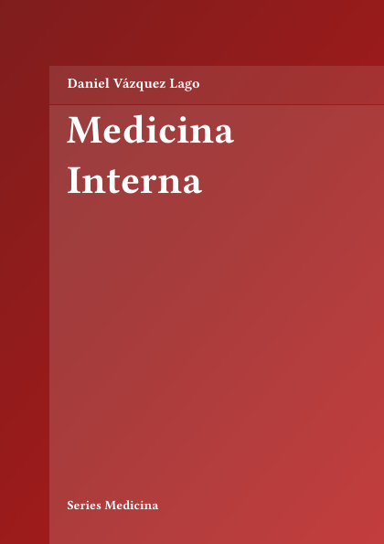 | **[Med-Medicina_Interna · Medicina Interna](cuadernos/Medicina/Medicina_Interna/)**<br>Cuaderno planificado con 6 partes previstas. | ⚪ **Planificado**<br>`░░░░░░░░░░` **5 %**<br>1 capítulo · 7 páginas<br>[PDF](pdf/Med-Medicina_Interna.pdf) · [Fuente](cuadernos/Medicina/Medicina_Interna/) | <strong>Razonamiento y exploración clínica</strong> <sub>(1 cap.)</sub> |
|  | **[Med-Neurologia · Neurología](cuadernos/Medicina/Neurologia/)**<br>Cuaderno planificado con 6 partes previstas. | ⚪ **Planificado**<br>`░░░░░░░░░░` **5 %**<br>1 capítulo · 7 páginas<br>[PDF](pdf/Med-Neurologia.pdf) · [Fuente](cuadernos/Medicina/Neurologia/) | <strong>Exploración neurológica</strong> <sub>(1 cap.)</sub> |
|  | **[Med-Oncologia · Oncología](cuadernos/Medicina/Oncologia/)**<br>Cuaderno planificado con 6 partes previstas. | ⚪ **Planificado**<br>`░░░░░░░░░░` **5 %**<br>1 capítulo · 7 páginas<br>[PDF](pdf/Med-Oncologia.pdf) · [Fuente](cuadernos/Medicina/Oncologia/) | <strong>Biología y genética del cáncer</strong> <sub>(1 cap.)</sub> |

### Economía

| Portada | Cuaderno | Estado y métricas | Partes |
|:---:|---|---|---|
|  | **[E-Econofisica · Econofísica](cuadernos/Economia/Econofisica/)**<br>Esquema editorial organizado en 6 partes; el desarrollo del texto está en fase inicial. | 🟤 **Esqueleto**<br>`░░░░░░░░░░` **2 %**<br>24 capítulos · 65 páginas<br>[PDF](pdf/E-Econofisica.pdf) · [Fuente](cuadernos/Economia/Econofisica/) | <strong>Fundamentos de econofísica</strong> <sub>(4 cap.)</sub><br><strong>Mercados y series temporales</strong> <sub>(4 cap.)</sub><br><strong>Modelos basados en agentes</strong> <sub>(4 cap.)</sub><br><strong>Redes económicas y riesgo sistémico</strong> <sub>(4 cap.)</sub><br><strong>Macroeconomía compleja</strong> <sub>(4 cap.)</sub><br><strong>Métodos computacionales</strong> <sub>(4 cap.)</sub> |
|  | **[E-Planificacion · Planificación Económica y Cibernética](cuadernos/Economia/Planificacion/)**<br>Cuaderno planificado con 6 partes previstas. | ⚪ **Planificado**<br>`░░░░░░░░░░` **5 %**<br>1 capítulo · 7 páginas<br>[PDF](pdf/E-Planificacion.pdf) · [Fuente](cuadernos/Economia/Planificacion/) | <strong>Fundamentos de la planificación</strong> <sub>(1 cap.)</sub> |

### Filosofía

| Portada | Cuaderno | Estado y métricas | Partes |
|:---:|---|---|---|
|  | **[Fil-Ciencia · Filosofía de la Ciencia](cuadernos/Filosofia/Ciencia/)**<br>Cuaderno planificado con 6 partes previstas. | ⚪ **Planificado**<br>`░░░░░░░░░░` **5 %**<br>1 capítulo · 7 páginas<br>[PDF](pdf/Fil-Ciencia.pdf) · [Fuente](cuadernos/Filosofia/Ciencia/) | <strong>Conocimiento y método científico</strong> <sub>(1 cap.)</sub> |
| 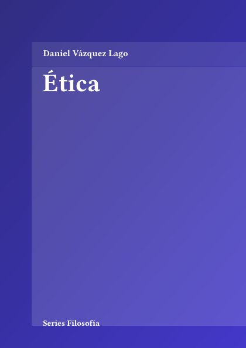 | **[Fil-Etica · Ética](cuadernos/Filosofia/Etica/)**<br>Cuaderno planificado con 6 partes previstas. | ⚪ **Planificado**<br>`░░░░░░░░░░` **5 %**<br>1 capítulo · 7 páginas<br>[PDF](pdf/Fil-Etica.pdf) · [Fuente](cuadernos/Filosofia/Etica/) | <strong>Fundamentos de la filosofía moral</strong> <sub>(1 cap.)</sub> |
|  | **[Fil-Politica · Filosofía Política](cuadernos/Filosofia/Politica/)**<br>Esquema editorial organizado en 6 partes; el desarrollo del texto está en fase inicial. | 🟤 **Esqueleto**<br>`░░░░░░░░░░` **2 %**<br>24 capítulos · 65 páginas<br>[PDF](pdf/Fil-Politica.pdf) · [Fuente](cuadernos/Filosofia/Politica/) | <strong>Fundamentos de filosofía política</strong> <sub>(4 cap.)</sub><br><strong>Pensamiento antiguo y medieval</strong> <sub>(4 cap.)</sub><br><strong>Pensamiento moderno</strong> <sub>(4 cap.)</sub><br><strong>Ideologías contemporáneas</strong> <sub>(4 cap.)</sub><br><strong>Estado e instituciones</strong> <sub>(4 cap.)</sub><br><strong>Debates actuales</strong> <sub>(4 cap.)</sub> |
|  | **[Fil-Teologia · Teología y Filosofía de la Religión](cuadernos/Filosofia/Teologia/)**<br>Cuaderno planificado con 6 partes previstas. | ⚪ **Planificado**<br>`░░░░░░░░░░` **5 %**<br>1 capítulo · 7 páginas<br>[PDF](pdf/Fil-Teologia.pdf) · [Fuente](cuadernos/Filosofia/Teologia/) | <strong>Conceptos fundamentales</strong> <sub>(1 cap.)</sub> |

### Ciencias sociales

| Portada | Cuaderno | Estado y métricas | Partes |
|:---:|---|---|---|
| 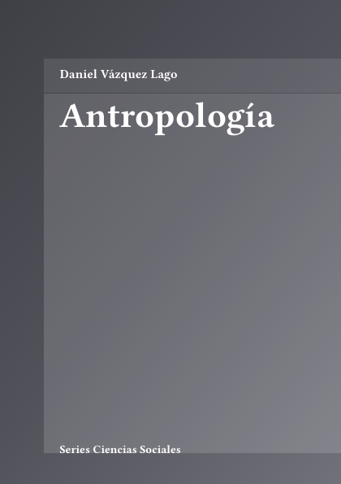 | **[Soc-Antropologia · Antropología](cuadernos/Sociales/Antropologia/)**<br>Cuaderno planificado con 6 partes previstas. | ⚪ **Planificado**<br>`░░░░░░░░░░` **5 %**<br>1 capítulo · 7 páginas<br>[PDF](pdf/Soc-Antropologia.pdf) · [Fuente](cuadernos/Sociales/Antropologia/) | <strong>Fundamentos de la antropología</strong> <sub>(1 cap.)</sub> |
| 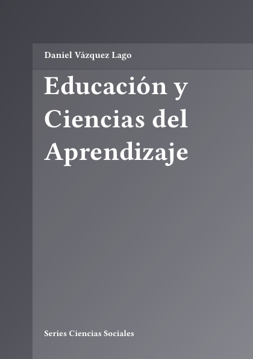 | **[Soc-Educacion · Educación y Ciencias del Aprendizaje](cuadernos/Sociales/Eduacion/)**<br>Cuaderno planificado con 6 partes previstas. | ⚪ **Planificado**<br>`░░░░░░░░░░` **5 %**<br>1 capítulo · 7 páginas<br>[PDF](pdf/Soc-Educacion.pdf) · [Fuente](cuadernos/Sociales/Eduacion/) | <strong>Historia y filosofía de la educación</strong> <sub>(1 cap.)</sub> |
|  | **[Soc-Sociofisica · Sociofísica](cuadernos/Sociales/Sociofisica/)**<br>Esquema editorial organizado en 6 partes; el desarrollo del texto está en fase inicial. | 🟤 **Esqueleto**<br>`░░░░░░░░░░` **2 %**<br>24 capítulos · 65 páginas<br>[PDF](pdf/Soc-Sociofisica.pdf) · [Fuente](cuadernos/Sociales/Sociofisica/) | <strong>Fundamentos de sociofísica</strong> <sub>(4 cap.)</sub><br><strong>Redes sociales</strong> <sub>(4 cap.)</sub><br><strong>Opinión y polarización</strong> <sub>(4 cap.)</sub><br><strong>Cooperación y conflicto</strong> <sub>(4 cap.)</sub><br><strong>Ciudades, movilidad y población</strong> <sub>(4 cap.)</sub><br><strong>Métodos computacionales</strong> <sub>(4 cap.)</sub> |
| 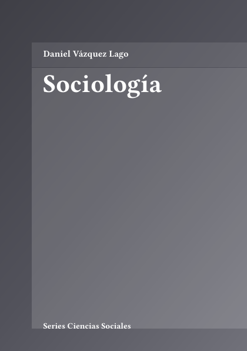 | **[Soc-Sociologia · Sociología](cuadernos/Sociales/Sociologia/)**<br>Cuaderno planificado con 6 partes previstas. | ⚪ **Planificado**<br>`░░░░░░░░░░` **5 %**<br>1 capítulo · 7 páginas<br>[PDF](pdf/Soc-Sociologia.pdf) · [Fuente](cuadernos/Sociales/Sociologia/) | <strong>Teoría sociológica clásica</strong> <sub>(1 cap.)</sub> |
| 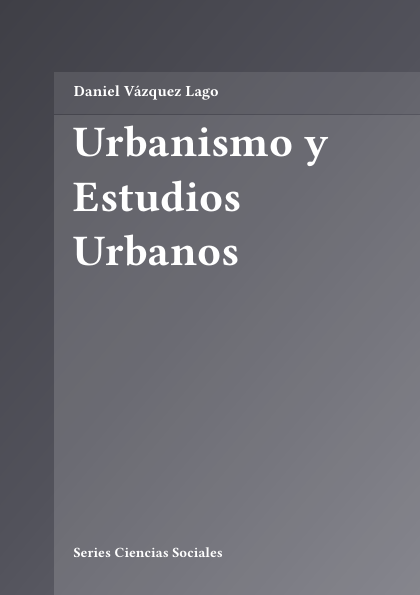 | **[Soc-Urbanismo · Urbanismo y Estudios Urbanos](cuadernos/Sociales/Urbanismo/)**<br>Cuaderno planificado con 6 partes previstas. | ⚪ **Planificado**<br>`░░░░░░░░░░` **5 %**<br>1 capítulo · 7 páginas<br>[PDF](pdf/Soc-Urbanismo.pdf) · [Fuente](cuadernos/Sociales/Urbanismo/) | <strong>Historia de la ciudad y el urbanismo</strong> <sub>(1 cap.)</sub> |

### Historia

| Portada | Cuaderno | Estado y métricas | Partes |
|:---:|---|---|---|
|  | **[H-China · Historia de China](cuadernos/Historia/China/)**<br>Cuaderno planificado con 6 partes previstas. | ⚪ **Planificado**<br>`░░░░░░░░░░` **5 %**<br>1 capítulo · 7 páginas<br>[PDF](pdf/H-China.pdf) · [Fuente](cuadernos/Historia/China/) | <strong>China antigua</strong> <sub>(1 cap.)</sub> |
|  | **[H-Espana · Historia de España](cuadernos/Historia/Espana/)**<br>Cuaderno planificado con 6 partes previstas. | ⚪ **Planificado**<br>`░░░░░░░░░░` **5 %**<br>1 capítulo · 7 páginas<br>[PDF](pdf/H-Espana.pdf) · [Fuente](cuadernos/Historia/Espana/) | <strong>Hispania antigua</strong> <sub>(1 cap.)</sub> |
|  | **[H-Roma · Hisotoria de Roma](cuadernos/Historia/Roma/)**<br>Esquema editorial organizado en 7 partes; el desarrollo del texto está en fase inicial. | 🟤 **Esqueleto**<br>`░░░░░░░░░░` **1 %**<br>28 capítulos · 75 páginas<br>[PDF](pdf/H-Roma.pdf) · [Fuente](cuadernos/Historia/Roma/) | <strong>Orígenes y monarquía</strong> <sub>(4 cap.)</sub><br><strong>República romana</strong> <sub>(4 cap.)</sub><br><strong>Crisis de la República</strong> <sub>(4 cap.)</sub><br><strong>Alto Imperio</strong> <sub>(4 cap.)</sub><br><strong>Sociedad, economía y cultura</strong> <sub>(4 cap.)</sub><br><strong>Antigüedad tardía</strong> <sub>(4 cap.)</sub><br><strong>Legado e historiografía</strong> <sub>(4 cap.)</sub> |
|  | **[H-Rusia · Historia de Rusia](cuadernos/Historia/Rusia/)**<br>Cuaderno planificado con 6 partes previstas. | ⚪ **Planificado**<br>`░░░░░░░░░░` **5 %**<br>1 capítulo · 7 páginas<br>[PDF](pdf/H-Rusia.pdf) · [Fuente](cuadernos/Historia/Rusia/) | <strong>Rus de Kiev y formación del Estado ruso</strong> <sub>(1 cap.)</sub> |

### Geografía

| Portada | Cuaderno | Estado y métricas | Partes |
|:---:|---|---|---|
|  | **[Geo-Geografia · Geografía](cuadernos/Geografia/Geografia/)**<br>Cuaderno planificado con 6 partes previstas. | ⚪ **Planificado**<br>`░░░░░░░░░░` **5 %**<br>1 capítulo · 7 páginas<br>[PDF](pdf/Geo-Geografia.pdf) · [Fuente](cuadernos/Geografia/Geografia/) | <strong>Fundamentos del análisis geográfico</strong> <sub>(1 cap.)</sub> |

### Literatura

| Portada | Cuaderno | Estado y métricas | Partes |
|:---:|---|---|---|
|  | **[L-Heroes · Héroes en la Literatura](cuadernos/Literatura/Heroes/)**<br>Esquema editorial organizado en 6 partes; el desarrollo del texto está en fase inicial. | 🟤 **Esqueleto**<br>`░░░░░░░░░░` **2 %**<br>24 capítulos · 65 páginas<br>[PDF](pdf/L-Heroes.pdf) · [Fuente](cuadernos/Literatura/Heroes/) | <strong>El héroe mítico</strong> <sub>(4 cap.)</sub><br><strong>Épica antigua</strong> <sub>(4 cap.)</sub><br><strong>Héroe medieval</strong> <sub>(4 cap.)</sub><br><strong>Modernidad y novela</strong> <sub>(4 cap.)</sub><br><strong>Antihéroe y crisis del sujeto</strong> <sub>(4 cap.)</sub><br><strong>Héroes contemporáneos</strong> <sub>(4 cap.)</sub> |
|  | **[L-Quijote · Don Quijote de la Mancha](cuadernos/Literatura/Quijote/)**<br>Cuaderno planificado con 6 partes previstas. | ⚪ **Planificado**<br>`░░░░░░░░░░` **5 %**<br>1 capítulo · 7 páginas<br>[PDF](pdf/L-Quijote.pdf) · [Fuente](cuadernos/Literatura/Quijote/) | <strong>Cervantes y su tiempo</strong> <sub>(1 cap.)</sub> |

### Programación

| Portada | Cuaderno | Estado y métricas | Partes |
|:---:|---|---|---|
|  | **[Pr-Aprendizaje_Automatico · Aprendizaje Automático](cuadernos/Programacion/Aprendizaje_Automatico/)**<br>Cuaderno planificado con 7 partes previstas. | ⚪ **Planificado**<br>`░░░░░░░░░░` **4 %**<br>1 capítulo · 7 páginas<br>[PDF](pdf/Pr-Aprendizaje_Automatico.pdf) · [Fuente](cuadernos/Programacion/Aprendizaje_Automatico/) | <strong>Fundamentos</strong> <sub>(1 cap.)</sub> |

### Ensayos políticos

| Portada | Cuaderno | Estado y métricas | Partes |
|:---:|---|---|---|
|  | **[Pol-Cibercomunismo · Cibcom](cuadernos/Politica/Cibercomunismo/)**<br>Esquema editorial organizado en 7 partes; el desarrollo del texto está en fase inicial. | 🟤 **Esqueleto**<br>`░░░░░░░░░░` **1 %**<br>28 capítulos · 73 páginas<br>[PDF](pdf/Pol-Cibercomunismo.pdf) · [Fuente](cuadernos/Politica/Cibercomunismo/) | <strong>Fundamentos</strong> <sub>(4 cap.)</sub><br><strong>Historia y antecedentes</strong> <sub>(4 cap.)</sub><br><strong>Infraestructura técnica</strong> <sub>(4 cap.)</sub><br><strong>Instituciones y gobernanza</strong> <sub>(4 cap.)</sub><br><strong>Economía política</strong> <sub>(4 cap.)</sub><br><strong>Derechos y riesgos</strong> <sub>(4 cap.)</sub><br><strong>Transición y evaluación</strong> <sub>(4 cap.)</sub> |
|  | **[Pol-Cientifica · Política Científica y Tecnológica](cuadernos/Politica/Cientifica/)**<br>Cuaderno planificado con 6 partes previstas. | ⚪ **Planificado**<br>`░░░░░░░░░░` **5 %**<br>1 capítulo · 7 páginas<br>[PDF](pdf/Pol-Cientifica.pdf) · [Fuente](cuadernos/Politica/Cientifica/) | <strong>Ciencia, tecnología y Estado</strong> <sub>(1 cap.)</sub> |
|  | **[Pol-Paniberismo · Paniberismo](cuadernos/Politica/Paniberismo/)**<br>Esquema editorial organizado en 7 partes; el desarrollo del texto está en fase inicial. | 🟤 **Esqueleto**<br>`░░░░░░░░░░` **1 %**<br>28 capítulos · 75 páginas<br>[PDF](pdf/Pol-Paniberismo.pdf) · [Fuente](cuadernos/Politica/Paniberismo/) | <strong>Fundamentos del paniberismo</strong> <sub>(4 cap.)</sub><br><strong>Historia compartida</strong> <sub>(4 cap.)</sub><br><strong>Lenguas y culturas</strong> <sub>(4 cap.)</sub><br><strong>Instituciones y ciudadanía</strong> <sub>(4 cap.)</sub><br><strong>Economía e infraestructuras</strong> <sub>(4 cap.)</sub><br><strong>Geopolítica y relaciones internacionales</strong> <sub>(4 cap.)</sub><br><strong>Escenarios y hoja de ruta</strong> <sub>(4 cap.)</sub> |

## Arquitectura editorial

Cada cuaderno es autocontenido: el archivo principal contiene sus metadatos, la configuración de portada y el orden de lectura.

```text
cuadernos/<Area>/<Cuaderno>/
├── <principal>.typ     # metadatos + configuración + estructura del libro
├── referencias.bib     # bibliografía del cuaderno
├── Capitulos/          # texto modular; los ejercicios cierran cada capítulo
├── Imagenes/           # portada y figuras
└── data/               # datos, tablas o material auxiliar
```

No existen `cuaderno.toml`, `content.typ` ni `generated/`. La portada se usa directamente desde `Imagenes/`, sin copias intermedias.

## Gestión del proyecto

| Comando | Función |
|---|---|
| `python run_all.py` | Lee los mains, valida, compila lo modificado y reconstruye README y catálogos. |
| `python -m cuadernos update --no-build` | Relee los mains y regenera los metadatos públicos sin compilar. |
| `python -m cuadernos update Fis-Electrodinamica` | Actualiza o compila únicamente un cuaderno. |
| `python -m cuadernos watch` | Vigila los mains, capítulos, imágenes, datos y bibliografías. |
| `python -m cuadernos check` | Valida IDs, rutas, portadas y bibliografía. |

Para crear un cuaderno nuevo, copia una carpeta existente, renombra el main y edita el bloque `notebook` del principio. Esa es la única alta necesaria.

## Fuentes de verdad

- `cuadernos.toml`: áreas, orden, prefijos y series globales.
- El bloque `notebook` de cada main: título, ID, estado, salida, portada, colores y bibliografía.
- El propio main y `Capitulos/`: partes, capítulos y contenido efectivo.
- `referencias.bib`: bibliografía local del volumen.
- `pdf/`: publicaciones compiladas.
- `docs/catalog.json`: catálogo derivado para otras aplicaciones.

## Convenciones

- Los nombres de carpetas y archivos usan ASCII portable; los títulos visibles conservan sus acentos.
- Los IDs son únicos y estables, aunque cambie el título del cuaderno.
- Las portadas admitidas son `solid`, `fullimage`, `wiley` y `wiley2`.
- Un concepto debe tener un cuaderno canónico; los demás lo resumen y enlazan para minimizar duplicaciones.

## Licencia y autoría

La autoría y las condiciones de uso de cada volumen se indican en el bloque `notebook` de su archivo principal y en el propio documento. Las imágenes y referencias externas deben conservar su atribución correspondiente.

---

Este README se genera automáticamente. Con `python -m cuadernos watch` —iniciado también por la tarea de VS Code— los cambios se reflejan al guardar.
