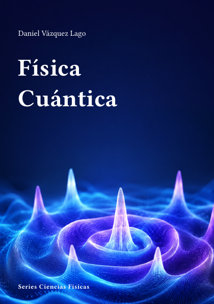
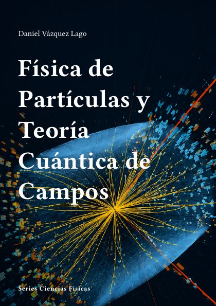
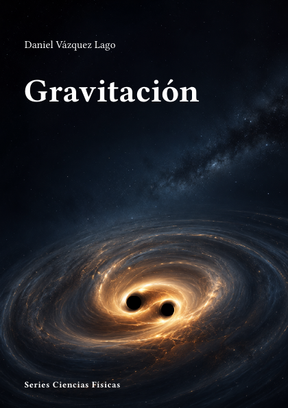
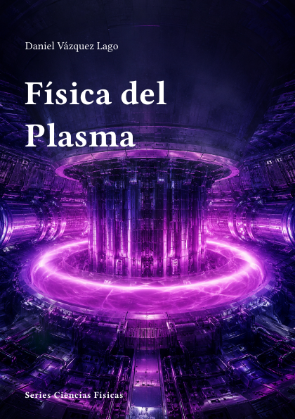
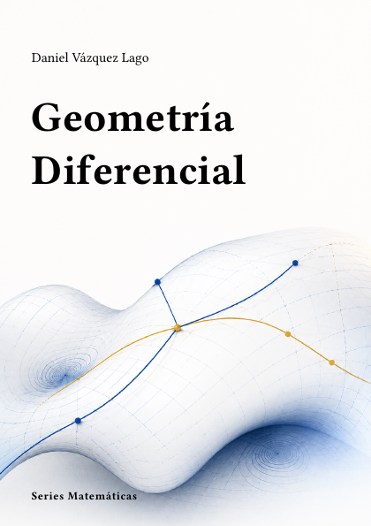

# Cuadernos

> Biblioteca abierta de cuadernos extensos de ciencias, ingeniería, humanidades y ciencias sociales, desarrollados en Typst y organizados como volúmenes conectados.

[](https://typst.app/)


## Estado general

| Cuadernos | Activos | PDF disponibles | PDF actualizados | Capítulos | Páginas compiladas | Progreso editorial |
|---:|---:|---:|---:|---:|---:|---:|
| **43** | **39** | **39** | **39** | **941** | **2577** | **3%** |

El porcentaje editorial se calcula automáticamente a partir del contenido Typst, figuras, ejercicios, referencias y estado de revisión. Puede cambiarse a modo manual en el `cuaderno.toml` de un volumen concreto.

## Inicio rápido

### Requisitos

- Python 3.11 o posterior.
- [Typst](https://typst.app/open-source/) disponible en `PATH`.
- Poppler (`pdfinfo` y `pdftoppm`) para contabilizar páginas y generar previsualizaciones.

### Un único comando

```bash
python -m cuadernos update
```

Este comando descubre todos los `cuaderno.toml`, sincroniza las partes, genera la configuración Typst, valida el proyecto, compila únicamente lo modificado, extrae automáticamente las portadas de la primera página de cada PDF y reconstruye el README y los catálogos.

También puede limitarse la compilación:

```bash
python -m cuadernos update F-08
python -m cuadernos update Medicina
python -m cuadernos update --force
```

Para actualizar el catálogo sin compilar:

```bash
python -m cuadernos update --no-build
```

## Catálogo

**Estados:** ⚪ Planificado · 🟤 Esqueleto · 🟡 En desarrollo · 🔵 Utilizable · 🟢 Estable · ⏸️ Pausado.

### Física

| Portada | Cuaderno | Estado y métricas | Partes |
|:---:|---|---|---|
|  | **[F-01 · Mecánica Clásica](cuadernos/Fisica/Mecanica_Clasica/)**<br>Esquema editorial organizado en 6 partes; el desarrollo del texto está en fase inicial. | 🟤 **Esqueleto**<br>`░░░░░░░░░░` **1 %**<br>22 capítulos · 59 páginas<br>[PDF](pdf/F-Mecanica_Clasica.pdf) · [Fuente](cuadernos/Fisica/Mecanica_Clasica/) | <strong>Fundamentos de la mecánica</strong> <sub>(3 cap.)</sub><br><strong>Mecánica analítica</strong> <sub>(4 cap.)</sub><br><strong>Mecánica hamiltoniana</strong> <sub>(4 cap.)</sub><br><strong>Sistemas de muchas partículas y sólidos rígidos</strong> <sub>(3 cap.)</sub><br><strong>Oscilaciones, ondas y medios continuos</strong> <sub>(4 cap.)</sub><br><strong>Dinámica no lineal y caos</strong> <sub>(4 cap.)</sub> |
|  | **[F-02 · Electrodinámica](cuadernos/Fisica/Electrodinamica/)**<br>Cuaderno organizado en 5 partes y 16 capítulos activos. | 🟤 **Esqueleto**<br>`░░░░░░░░░░` **2 %**<br>16 capítulos · 45 páginas<br>[PDF](pdf/F-Electrodinamica.pdf) · [Fuente](cuadernos/Fisica/Electrodinamica/) | <strong>Contenido</strong> <sub>(1 cap.)</sub><br><strong>Electrostática</strong> <sub>(3 cap.)</sub><br><strong>Magnetostática</strong> <sub>(3 cap.)</sub><br><strong>Electrodinámica</strong> <sub>(6 cap.)</sub><br><strong>Radiación</strong> <sub>(3 cap.)</sub> |
|  | **[F-03 · Termodinámica y Mecánica Estadística](cuadernos/Fisica/Termodinamica/)**<br>Esquema editorial organizado en 7 partes; el desarrollo del texto está en fase inicial. | 🟤 **Esqueleto**<br>`░░░░░░░░░░` **1 %**<br>28 capítulos · 73 páginas<br>[PDF](pdf/F-Termodinamica.pdf) · [Fuente](cuadernos/Fisica/Termodinamica/) | <strong>Fundamentos termodinámicos</strong> <sub>(4 cap.)</sub><br><strong>Potenciales y equilibrio</strong> <sub>(4 cap.)</sub><br><strong>Mecánica estadística clásica</strong> <sub>(4 cap.)</sub><br><strong>Estadística cuántica</strong> <sub>(4 cap.)</sub><br><strong>Transiciones de fase y fenómenos críticos</strong> <sub>(4 cap.)</sub><br><strong>Procesos irreversibles</strong> <sub>(4 cap.)</sub><br><strong>Sistemas complejos</strong> <sub>(4 cap.)</sub> |
|  | **[F-04 · Física Cuántica](cuadernos/Fisica/Fisica_Cuantica/)**<br>Esquema editorial organizado en 7 partes; el desarrollo del texto está en fase inicial. | 🟤 **Esqueleto**<br>`░░░░░░░░░░` **1 %**<br>28 capítulos · 73 páginas<br>[PDF](pdf/F-Cuantica.pdf) · [Fuente](cuadernos/Fisica/Fisica_Cuantica/) | <strong>Fundamentos de la teoría cuántica</strong> <sub>(4 cap.)</sub><br><strong>Dinámica cuántica</strong> <sub>(4 cap.)</sub><br><strong>Sistemas elementales</strong> <sub>(4 cap.)</sub><br><strong>Métodos de aproximación</strong> <sub>(4 cap.)</sub><br><strong>Sistemas compuestos y partículas idénticas</strong> <sub>(4 cap.)</sub><br><strong>Sistemas abiertos e información cuántica</strong> <sub>(4 cap.)</sub><br><strong>Tecnologías cuánticas</strong> <sub>(4 cap.)</sub> |
|  | **[F-05 · Física Atómica y Molecular](cuadernos/Fisica/Atomica_Molecular/)**<br>Esquema editorial organizado en 6 partes; el desarrollo del texto está en fase inicial. | 🟤 **Esqueleto**<br>`░░░░░░░░░░` **1 %**<br>24 capítulos · 63 páginas<br>[PDF](pdf/F-Atomica.pdf) · [Fuente](cuadernos/Fisica/Atomica_Molecular/) | <strong>Estructura atómica</strong> <sub>(4 cap.)</sub><br><strong>Interacción radiación-materia</strong> <sub>(4 cap.)</sub><br><strong>Física molecular</strong> <sub>(4 cap.)</sub><br><strong>Espectroscopia</strong> <sub>(4 cap.)</sub><br><strong>Colisiones y materia fría</strong> <sub>(4 cap.)</sub><br><strong>Aplicaciones y métodos experimentales</strong> <sub>(4 cap.)</sub> |
|  | **[F-06 · Física del Estado Sólido](cuadernos/Fisica/Estado_Solido/)**<br>Esquema editorial organizado en 7 partes; el desarrollo del texto está en fase inicial. | 🟤 **Esqueleto**<br>`░░░░░░░░░░` **1 %**<br>28 capítulos · 73 páginas<br>[PDF](pdf/F-Estado_Solido.pdf) · [Fuente](cuadernos/Fisica/Estado_Solido/) | <strong>Estructura cristalina</strong> <sub>(4 cap.)</sub><br><strong>Electrones en sólidos</strong> <sub>(4 cap.)</sub><br><strong>Dinámica de la red</strong> <sub>(4 cap.)</sub><br><strong>Transporte electrónico</strong> <sub>(4 cap.)</sub><br><strong>Magnetismo</strong> <sub>(4 cap.)</sub><br><strong>Superconductividad</strong> <sub>(4 cap.)</sub><br><strong>Materia condensada avanzada</strong> <sub>(4 cap.)</sub> |
|  | **[F-07 · Física Nuclear](cuadernos/Fisica/Fisica_Nuclear/)**<br>Esquema editorial organizado en 7 partes; el desarrollo del texto está en fase inicial. | 🟤 **Esqueleto**<br>`░░░░░░░░░░` **1 %**<br>28 capítulos · 73 páginas<br>[PDF](pdf/F-Nuclear.pdf) · [Fuente](cuadernos/Fisica/Fisica_Nuclear/) | <strong>Propiedades del núcleo</strong> <sub>(4 cap.)</sub><br><strong>Modelos nucleares</strong> <sub>(4 cap.)</sub><br><strong>Desintegraciones radiactivas</strong> <sub>(4 cap.)</sub><br><strong>Reacciones nucleares</strong> <sub>(4 cap.)</sub><br><strong>Fisión y fusión</strong> <sub>(4 cap.)</sub><br><strong>Astrofísica nuclear</strong> <sub>(4 cap.)</sub><br><strong>Aplicaciones</strong> <sub>(4 cap.)</sub> |
|  | **[F-08 · Física de Partículas y Teoría Cuántica de Campos](cuadernos/Fisica/Fisica_Particulas/)**<br>Esquema editorial organizado en 8 partes; el desarrollo del texto está en fase inicial. | 🟤 **Esqueleto**<br>`░░░░░░░░░░` **1 %**<br>32 capítulos · 85 páginas<br>[PDF](pdf/F-Fisica_Particulas.pdf) · [Fuente](cuadernos/Fisica/Fisica_Particulas/) | <strong>Fundamentos y simetrías</strong> <sub>(4 cap.)</sub><br><strong>Mecánica cuántica relativista</strong> <sub>(4 cap.)</sub><br><strong>Campos clásicos</strong> <sub>(4 cap.)</sub><br><strong>Teoría cuántica de campos</strong> <sub>(4 cap.)</sub><br><strong>Teorías gauge y modelo estándar</strong> <sub>(4 cap.)</sub><br><strong>Fenomenología de partículas</strong> <sub>(4 cap.)</sub><br><strong>Más allá del modelo estándar</strong> <sub>(4 cap.)</sub><br><strong>Astropartículas y cosmología de partículas</strong> <sub>(4 cap.)</sub> |
|  | **[F-09 · Gravitación](cuadernos/Fisica/Gravitacion/)**<br>Esquema editorial organizado en 7 partes; el desarrollo del texto está en fase inicial. | 🟤 **Esqueleto**<br>`░░░░░░░░░░` **1 %**<br>28 capítulos · 73 páginas<br>[PDF](pdf/F-Gravitacion.pdf) · [Fuente](cuadernos/Fisica/Gravitacion/) | <strong>Relatividad especial</strong> <sub>(4 cap.)</sub><br><strong>Geometría del espacio-tiempo</strong> <sub>(4 cap.)</sub><br><strong>Relatividad general</strong> <sub>(4 cap.)</sub><br><strong>Soluciones y objetos compactos</strong> <sub>(4 cap.)</sub><br><strong>Ondas gravitacionales</strong> <sub>(4 cap.)</sub><br><strong>Cosmología relativista</strong> <sub>(4 cap.)</sub><br><strong>Gravedad avanzada</strong> <sub>(4 cap.)</sub> |
|  | **[F-10 · Astrofísica y Cosmología](cuadernos/Fisica/Astrofisica/)**<br>Cuaderno organizado en 3 partes y 3 capítulos activos. | 🟤 **Esqueleto**<br>`░░░░░░░░░░` **3 %**<br>3 capítulos · 17 páginas<br>[PDF](pdf/F-Astrofisica.pdf) · [Fuente](cuadernos/Fisica/Astrofisica/) | <strong>Astrofísica Nuclear</strong> <sub>(1 cap.)</sub><br><strong>Nucleosíntesis Estelar y Primordial</strong> <sub>(2 cap.)</sub><br><strong>Cosmología</strong> <sub>(0 cap.)</sub> |
|  | **[F-11 · Física de Fluidos](cuadernos/Fisica/Fisica_Fluidos/)**<br>Esquema editorial organizado en 7 partes; el desarrollo del texto está en fase inicial. | 🟤 **Esqueleto**<br>`░░░░░░░░░░` **1 %**<br>28 capítulos · 73 páginas<br>[PDF](pdf/F-Fluidos.pdf) · [Fuente](cuadernos/Fisica/Fisica_Fluidos/) | <strong>Fundamentos de medios continuos</strong> <sub>(4 cap.)</sub><br><strong>Fluidos ideales</strong> <sub>(4 cap.)</sub><br><strong>Fluidos viscosos</strong> <sub>(4 cap.)</sub><br><strong>Capas límite y aerodinámica</strong> <sub>(4 cap.)</sub><br><strong>Turbulencia</strong> <sub>(4 cap.)</sub><br><strong>Flujos compresibles</strong> <sub>(4 cap.)</sub><br><strong>Fluidos multifásicos y geofísicos</strong> <sub>(4 cap.)</sub> |
|  | **[F-12 · Detectores en Física Nuclear y Partículas](cuadernos/Fisica/Detectores_Particulas/)**<br>Cuaderno organizado en 7 partes y 11 capítulos activos. | 🟤 **Esqueleto**<br>`░░░░░░░░░░` **3 %**<br>11 capítulos · 53 páginas<br>[PDF](pdf/F-DetectoresParticulas.pdf) · [Fuente](cuadernos/Fisica/Detectores_Particulas/) | <strong>Interacción radiación–materia</strong> <sub>(0 cap.)</sub><br><strong>Electrónica</strong> <sub>(0 cap.)</sub><br><strong>Estadística</strong> <sub>(0 cap.)</sub><br><strong>Aceleradores</strong> <sub>(1 cap.)</sub><br><strong>Detectores</strong> <sub>(9 cap.)</sub><br><strong>Simulación en física de detectores</strong> <sub>(0 cap.)</sub><br><strong>Aplicaciones</strong> <sub>(1 cap.)</sub> |
|  | **[F-13 · Física del Plasma](cuadernos/Fisica/Fisica_Plasma/)**<br>Esquema editorial organizado en 8 partes; el desarrollo del texto está en fase inicial. | 🟤 **Esqueleto**<br>`░░░░░░░░░░` **1 %**<br>32 capítulos · 85 páginas<br>[PDF](pdf/F-FisicaPlasma.pdf) · [Fuente](cuadernos/Fisica/Fisica_Plasma/) | <strong>Fundamentos del plasma</strong> <sub>(4 cap.)</sub><br><strong>Movimiento de partículas</strong> <sub>(4 cap.)</sub><br><strong>Teoría cinética</strong> <sub>(4 cap.)</sub><br><strong>Descripción fluida y MHD</strong> <sub>(4 cap.)</sub><br><strong>Ondas e inestabilidades</strong> <sub>(4 cap.)</sub><br><strong>Plasmas fríos y descargas</strong> <sub>(4 cap.)</sub><br><strong>Fusión y confinamiento</strong> <sub>(4 cap.)</sub><br><strong>Plasmas espaciales y astrofísicos</strong> <sub>(4 cap.)</sub> |
|  | **[F-14 · Óptica](cuadernos/Fisica/Optica/)**<br>Esquema editorial organizado en 7 partes; el desarrollo del texto está en fase inicial. | 🟤 **Esqueleto**<br>`░░░░░░░░░░` **1 %**<br>28 capítulos · 73 páginas<br>[PDF](pdf/F-Optica.pdf) · [Fuente](cuadernos/Fisica/Optica/) | <strong>Óptica geométrica</strong> <sub>(4 cap.)</sub><br><strong>Óptica ondulatoria</strong> <sub>(4 cap.)</sub><br><strong>Coherencia y Fourier</strong> <sub>(4 cap.)</sub><br><strong>Instrumentación óptica</strong> <sub>(4 cap.)</sub><br><strong>Óptica de medios</strong> <sub>(4 cap.)</sub><br><strong>Óptica no lineal</strong> <sub>(4 cap.)</sub><br><strong>Óptica cuántica</strong> <sub>(4 cap.)</sub> |
|  | **[F-15 · Láser](cuadernos/Fisica/Laser/)**<br>Esquema editorial organizado en 6 partes; el desarrollo del texto está en fase inicial. | 🟤 **Esqueleto**<br>`░░░░░░░░░░` **1 %**<br>24 capítulos · 63 páginas<br>[PDF](pdf/F-Laser.pdf) · [Fuente](cuadernos/Fisica/Laser/) | <strong>Interacción luz-materia</strong> <sub>(4 cap.)</sub><br><strong>Resonadores ópticos</strong> <sub>(4 cap.)</sub><br><strong>Dinámica del láser</strong> <sub>(4 cap.)</sub><br><strong>Tipos de láser</strong> <sub>(4 cap.)</sub><br><strong>Pulsos ultracortos</strong> <sub>(4 cap.)</sub><br><strong>Aplicaciones</strong> <sub>(4 cap.)</sub> |
|  | **[F-16 · Física de Semiconductores y Electrónica](cuadernos/Fisica/Semiconductores/)**<br>Esquema editorial organizado en 6 partes; el desarrollo del texto está en fase inicial. | 🟤 **Esqueleto**<br>`░░░░░░░░░░` **1 %**<br>24 capítulos · 63 páginas<br>[PDF](pdf/F-Semiconductores.pdf) · [Fuente](cuadernos/Fisica/Semiconductores/) | <strong>Fundamentos de semiconductores</strong> <sub>(4 cap.)</sub><br><strong>Uniones y contactos</strong> <sub>(4 cap.)</sub><br><strong>Transistores</strong> <sub>(4 cap.)</sub><br><strong>Optoelectrónica</strong> <sub>(4 cap.)</sub><br><strong>Fabricación y caracterización</strong> <sub>(4 cap.)</sub><br><strong>Nanoelectrónica y dispositivos avanzados</strong> <sub>(4 cap.)</sub> |

### Matemáticas

| Portada | Cuaderno | Estado y métricas | Partes |
|:---:|---|---|---|
|  | **[M-01 · Teoría de Grupos](cuadernos/Matematicas/Teoria_Grupos/)**<br>Cuaderno organizado en 3 partes y 7 capítulos activos. | 🟡 **En desarrollo**<br>`████░░░░░░` **41 %**<br>7 capítulos · 53 páginas<br>[PDF](pdf/M-Teoria_Grupos.pdf) · [Fuente](cuadernos/Matematicas/Teoria_Grupos/) | <strong>Introducción y Grupos Discretos</strong> <sub>(3 cap.)</sub><br><strong>Grupos Continuos</strong> <sub>(1 cap.)</sub><br><strong>Teoría de Grupos aplicada a la física</strong> <sub>(3 cap.)</sub> |
|  | **[M-02 · Geometría Diferencial](cuadernos/Matematicas/Geometria_Diferencial/)**<br>Cuaderno organizado en 4 partes y 24 capítulos activos. | 🟤 **Esqueleto**<br>`█░░░░░░░░░` **7 %**<br>24 capítulos · 45 páginas<br>[PDF](pdf/M-Geometria_Diferencial.pdf) · [Fuente](cuadernos/Matematicas/Geometria_Diferencial/) | <strong>Variedades Diferenciales</strong> <sub>(7 cap.)</sub><br><strong>Geometría de Riemann</strong> <sub>(5 cap.)</sub><br><strong>Relatividad General</strong> <sub>(7 cap.)</sub><br><strong>Teorías de Gauge</strong> <sub>(5 cap.)</sub> |

### Ingeniería

| Portada | Cuaderno | Estado y métricas | Partes |
|:---:|---|---|---|
|  | **[I-01 · Ingeniería Mecánica](cuadernos/Ingenieria/Mecanica/)**<br>Esquema editorial organizado en 7 partes; el desarrollo del texto está en fase inicial. | 🟤 **Esqueleto**<br>`░░░░░░░░░░` **1 %**<br>28 capítulos · 73 páginas<br>[PDF](pdf/I-Mecanica.pdf) · [Fuente](cuadernos/Ingenieria/Mecanica/) | <strong>Mecánica y materiales</strong> <sub>(4 cap.)</sub><br><strong>Diseño mecánico</strong> <sub>(4 cap.)</sub><br><strong>Máquinas y vibraciones</strong> <sub>(4 cap.)</sub><br><strong>Sistemas térmicos y fluidos</strong> <sub>(4 cap.)</sub><br><strong>Fabricación</strong> <sub>(4 cap.)</sub><br><strong>Mecatrónica y control</strong> <sub>(4 cap.)</sub><br><strong>Fiabilidad y proyecto</strong> <sub>(4 cap.)</sub> |
|  | **[I-02 · Ingeniería Eléctrica](cuadernos/Ingenieria/Electrica/)**<br>Esquema editorial organizado en 6 partes; el desarrollo del texto está en fase inicial. | 🟤 **Esqueleto**<br>`░░░░░░░░░░` **1 %**<br>24 capítulos · 63 páginas<br>[PDF](pdf/I-Electrica.pdf) · [Fuente](cuadernos/Ingenieria/Electrica/) | <strong>Circuitos y electromagnetismo</strong> <sub>(4 cap.)</sub><br><strong>Máquinas eléctricas</strong> <sub>(4 cap.)</sub><br><strong>Electrónica de potencia</strong> <sub>(4 cap.)</sub><br><strong>Generación y redes</strong> <sub>(4 cap.)</sub><br><strong>Alta tensión y protecciones</strong> <sub>(4 cap.)</sub><br><strong>Sistemas eléctricos modernos</strong> <sub>(4 cap.)</sub> |
|  | **[I-03 · Ingeniería Electrónica](cuadernos/Ingenieria/Electronica/)**<br>Esquema editorial organizado en 6 partes; el desarrollo del texto está en fase inicial. | 🟤 **Esqueleto**<br>`░░░░░░░░░░` **1 %**<br>24 capítulos · 63 páginas<br>[PDF](pdf/I-Electronica.pdf) · [Fuente](cuadernos/Ingenieria/Electronica/) | <strong>Dispositivos electrónicos</strong> <sub>(4 cap.)</sub><br><strong>Electrónica analógica</strong> <sub>(4 cap.)</sub><br><strong>Electrónica digital</strong> <sub>(4 cap.)</sub><br><strong>Sistemas embebidos</strong> <sub>(4 cap.)</sub><br><strong>Electrónica de potencia</strong> <sub>(4 cap.)</sub><br><strong>Diseño y fabricación</strong> <sub>(4 cap.)</sub> |
|  | **[I-04 · Sensores e Instrumentación](cuadernos/Ingenieria/Sensores_Instrumentacion/)**<br>Esquema editorial organizado en 6 partes; el desarrollo del texto está en fase inicial. | 🟤 **Esqueleto**<br>`░░░░░░░░░░` **1 %**<br>24 capítulos · 63 páginas<br>[PDF](pdf/I-Sensores.pdf) · [Fuente](cuadernos/Ingenieria/Sensores_Instrumentacion/) | <strong>Ciencia de la medida</strong> <sub>(4 cap.)</sub><br><strong>Sensores físicos</strong> <sub>(4 cap.)</sub><br><strong>Sensores químicos y biológicos</strong> <sub>(4 cap.)</sub><br><strong>Acondicionamiento de señal</strong> <sub>(4 cap.)</sub><br><strong>Adquisición e instrumentación</strong> <sub>(4 cap.)</sub><br><strong>Integración y aplicaciones</strong> <sub>(4 cap.)</sub> |
|  | **[I-05 · Ingeniería de Telecomunicaciones](cuadernos/Ingenieria/Telecomunicaciones/)**<br>Esquema editorial organizado en 7 partes; el desarrollo del texto está en fase inicial. | 🟤 **Esqueleto**<br>`░░░░░░░░░░` **1 %**<br>28 capítulos · 73 páginas<br>[PDF](pdf/I-Teleco.pdf) · [Fuente](cuadernos/Ingenieria/Telecomunicaciones/) | <strong>Señales y sistemas</strong> <sub>(4 cap.)</sub><br><strong>Comunicaciones analógicas y digitales</strong> <sub>(4 cap.)</sub><br><strong>Información y codificación</strong> <sub>(4 cap.)</sub><br><strong>Radiofrecuencia y microondas</strong> <sub>(4 cap.)</sub><br><strong>Antenas y propagación</strong> <sub>(4 cap.)</sub><br><strong>Comunicaciones ópticas</strong> <sub>(4 cap.)</sub><br><strong>Redes y sistemas modernos</strong> <sub>(4 cap.)</sub> |
|  | **[I-06 · Ingeniería Aeroespacial y Aeronáutica](cuadernos/Ingenieria/Aeroespacial/)**<br>Esquema editorial organizado en 7 partes; el desarrollo del texto está en fase inicial. | 🟤 **Esqueleto**<br>`░░░░░░░░░░` **1 %**<br>28 capítulos · 73 páginas<br>[PDF](pdf/I-Aeroespacial.pdf) · [Fuente](cuadernos/Ingenieria/Aeroespacial/) | <strong>Aerodinámica</strong> <sub>(4 cap.)</sub><br><strong>Mecánica de vuelo</strong> <sub>(4 cap.)</sub><br><strong>Propulsión</strong> <sub>(4 cap.)</sub><br><strong>Estructuras y materiales</strong> <sub>(4 cap.)</sub><br><strong>Aviónica y sistemas</strong> <sub>(4 cap.)</sub><br><strong>Ingeniería espacial</strong> <sub>(4 cap.)</sub><br><strong>Diseño y certificación</strong> <sub>(4 cap.)</sub> |
|  | **[I-07 · Ingeniería de la Automoción](cuadernos/Ingenieria/Automocion/)**<br>Esquema editorial organizado en 6 partes; el desarrollo del texto está en fase inicial. | 🟤 **Esqueleto**<br>`░░░░░░░░░░` **1 %**<br>24 capítulos · 63 páginas<br>[PDF](pdf/I-Automocion.pdf) · [Fuente](cuadernos/Ingenieria/Automocion/) | <strong>Arquitectura del vehículo</strong> <sub>(4 cap.)</sub><br><strong>Propulsión</strong> <sub>(4 cap.)</sub><br><strong>Dinámica del vehículo</strong> <sub>(4 cap.)</sub><br><strong>Estructuras y fabricación</strong> <sub>(4 cap.)</sub><br><strong>Electrónica y control</strong> <sub>(4 cap.)</sub><br><strong>Seguridad y sostenibilidad</strong> <sub>(4 cap.)</sub> |
|  | **[I-08 · Ingeniería Naval](cuadernos/Ingenieria/Naval/)**<br>Esquema editorial organizado en 7 partes; el desarrollo del texto está en fase inicial. | 🟤 **Esqueleto**<br>`░░░░░░░░░░` **1 %**<br>28 capítulos · 73 páginas<br>[PDF](pdf/I-Naval.pdf) · [Fuente](cuadernos/Ingenieria/Naval/) | <strong>Hidrostática y estabilidad</strong> <sub>(4 cap.)</sub><br><strong>Hidrodinámica naval</strong> <sub>(4 cap.)</sub><br><strong>Estructuras navales</strong> <sub>(4 cap.)</sub><br><strong>Propulsión y energía</strong> <sub>(4 cap.)</sub><br><strong>Sistemas del buque</strong> <sub>(4 cap.)</sub><br><strong>Construcción y proyecto</strong> <sub>(4 cap.)</sub><br><strong>Ingeniería oceánica</strong> <sub>(4 cap.)</sub> |
|  | **[I-09 · Ingeniería Energética](cuadernos/Ingenieria/Energetica/)**<br>Esquema editorial organizado en 7 partes; el desarrollo del texto está en fase inicial. | 🟤 **Esqueleto**<br>`░░░░░░░░░░` **1 %**<br>28 capítulos · 73 páginas<br>[PDF](pdf/I-Energetica.pdf) · [Fuente](cuadernos/Ingenieria/Energetica/) | <strong>Fundamentos energéticos</strong> <sub>(4 cap.)</sub><br><strong>Sistemas térmicos</strong> <sub>(4 cap.)</sub><br><strong>Energías renovables</strong> <sub>(4 cap.)</sub><br><strong>Almacenamiento e hidrógeno</strong> <sub>(4 cap.)</sub><br><strong>Sistemas eléctricos y redes</strong> <sub>(4 cap.)</sub><br><strong>Energía nuclear</strong> <sub>(4 cap.)</sub><br><strong>Eficiencia y ambiente</strong> <sub>(4 cap.)</sub> |
|  | **[I-10 · Ingeniería de Minas](cuadernos/Ingenieria/Minas/)**<br>Esquema editorial organizado en 7 partes; el desarrollo del texto está en fase inicial. | 🟤 **Esqueleto**<br>`░░░░░░░░░░` **1 %**<br>28 capítulos · 73 páginas<br>[PDF](pdf/I-Minas.pdf) · [Fuente](cuadernos/Ingenieria/Minas/) | <strong>Geología y exploración</strong> <sub>(4 cap.)</sub><br><strong>Explotación minera</strong> <sub>(4 cap.)</sub><br><strong>Mecánica de rocas</strong> <sub>(4 cap.)</sub><br><strong>Ventilación y servicios</strong> <sub>(4 cap.)</sub><br><strong>Procesamiento de minerales</strong> <sub>(4 cap.)</sub><br><strong>Seguridad y medio ambiente</strong> <sub>(4 cap.)</sub><br><strong>Economía y gestión</strong> <sub>(4 cap.)</sub> |
|  | **[I-11 · Ingeniería Biomédica](cuadernos/Ingenieria/Biomedica/)**<br>Esquema editorial organizado en 6 partes; el desarrollo del texto está en fase inicial. | 🟤 **Esqueleto**<br>`░░░░░░░░░░` **1 %**<br>24 capítulos · 63 páginas<br>[PDF](pdf/I-Biomedica.pdf) · [Fuente](cuadernos/Ingenieria/Biomedica/) | <strong>Fundamentos biomédicos</strong> <sub>(4 cap.)</sub><br><strong>Instrumentación biomédica</strong> <sub>(4 cap.)</sub><br><strong>Señales e imágenes médicas</strong> <sub>(4 cap.)</sub><br><strong>Dispositivos y prótesis</strong> <sub>(4 cap.)</sub><br><strong>Ingeniería clínica</strong> <sub>(4 cap.)</sub><br><strong>Regulación y diseño</strong> <sub>(4 cap.)</sub> |
|  | **[I-12 · Ingeniería Biotecnológica](cuadernos/Ingenieria/Biotecnologia/)**<br>Esquema editorial organizado en 7 partes; el desarrollo del texto está en fase inicial. | 🟤 **Esqueleto**<br>`░░░░░░░░░░` **1 %**<br>28 capítulos · 73 páginas<br>[PDF](pdf/I-Biotecnologia.pdf) · [Fuente](cuadernos/Ingenieria/Biotecnologia/) | <strong>Biología molecular para ingeniería</strong> <sub>(4 cap.)</sub><br><strong>Ingeniería genética y sintética</strong> <sub>(4 cap.)</sub><br><strong>Bioprocesos</strong> <sub>(4 cap.)</sub><br><strong>Operaciones de separación</strong> <sub>(4 cap.)</sub><br><strong>Omicas y biología computacional</strong> <sub>(4 cap.)</sub><br><strong>Aplicaciones</strong> <sub>(4 cap.)</sub><br><strong>Calidad y regulación</strong> <sub>(4 cap.)</sub> |
|  | **[I-13 · Ingeniería Militar](cuadernos/Ingenieria/Militar/)**<br>Esquema editorial organizado en 6 partes; el desarrollo del texto está en fase inicial. | 🟤 **Esqueleto**<br>`░░░░░░░░░░` **1 %**<br>24 capítulos · 63 páginas<br>[PDF](pdf/I-Militar.pdf) · [Fuente](cuadernos/Ingenieria/Militar/) | <strong>Ingeniería de sistemas de defensa</strong> <sub>(4 cap.)</sub><br><strong>Infraestructuras y movilidad</strong> <sub>(4 cap.)</sub><br><strong>Sensores, comunicaciones y mando</strong> <sub>(4 cap.)</sub><br><strong>Plataformas y protección</strong> <sub>(4 cap.)</sub><br><strong>Logística y operaciones</strong> <sub>(4 cap.)</sub><br><strong>Seguridad y resiliencia</strong> <sub>(4 cap.)</sub> |
|  | **[I-14 · Nanotecnología e Ingeniería de Nanomateriales](cuadernos/Ingenieria/Nanotecnologia/)**<br>Cuaderno planificado con 6 partes previstas. | ⚪ **Planificado**<br>`░░░░░░░░░░` **0 %**<br>0 capítulos · 0 páginas<br>PDF pendiente · [Fuente](cuadernos/Ingenieria/Nanotecnologia/) | <strong>Fundamentos de la nanoescala</strong> <sub>(0 cap.)</sub><br><strong>Caracterización</strong> <sub>(0 cap.)</sub><br><strong>Nanomateriales</strong> <sub>(0 cap.)</sub><br><strong>Nanofabricación</strong> <sub>(0 cap.)</sub><br><strong>Nanodispositivos</strong> <sub>(0 cap.)</sub><br><strong>Aplicaciones, seguridad y regulación</strong> <sub>(0 cap.)</sub> |

### Química

| Portada | Cuaderno | Estado y métricas | Partes |
|:---:|---|---|---|
|  | **[Q-01 · Ingeniería Química](cuadernos/Quimica/Ingenieria_Quimica/)**<br>Cuaderno desarrollado de ingeniería química con balances, transporte y operaciones de separación. | 🟡 **En desarrollo**<br>`██████░░░░` **57 %**<br>6 capítulos · 63 páginas<br>[PDF](pdf/Q-Ingenieria_Quimica.pdf) · [Fuente](cuadernos/Quimica/Ingenieria_Quimica/) | <strong>Fundamentos y balances</strong> <sub>(3 cap.)</sub><br><strong>Fenómenos de transporte</strong> <sub>(2 cap.)</sub><br><strong>Operaciones de separación</strong> <sub>(1 cap.)</sub><br><strong>Diseño, control y seguridad de procesos</strong> <sub>(0 cap.)</sub> |
|  | **[Q-02 · Química Orgánica](cuadernos/Quimica/Quimica_Organica/)**<br>Cuaderno planificado con 7 partes previstas. | ⚪ **Planificado**<br>`░░░░░░░░░░` **0 %**<br>0 capítulos · 0 páginas<br>PDF pendiente · [Fuente](cuadernos/Quimica/Quimica_Organica/) | <strong>Estructura y enlace</strong> <sub>(0 cap.)</sub><br><strong>Estereoquímica</strong> <sub>(0 cap.)</sub><br><strong>Mecanismos de reacción</strong> <sub>(0 cap.)</sub><br><strong>Síntesis orgánica</strong> <sub>(0 cap.)</sub><br><strong>Química de grupos funcionales</strong> <sub>(0 cap.)</sub><br><strong>Espectroscopia y elucidación</strong> <sub>(0 cap.)</sub><br><strong>Química medicinal y polímeros</strong> <sub>(0 cap.)</sub> |

### Economía

| Portada | Cuaderno | Estado y métricas | Partes |
|:---:|---|---|---|
|  | **[E-01 · Econofísica](cuadernos/Economia/Econofisica/)**<br>Esquema editorial organizado en 6 partes; el desarrollo del texto está en fase inicial. | 🟤 **Esqueleto**<br>`░░░░░░░░░░` **2 %**<br>24 capítulos · 65 páginas<br>[PDF](pdf/E-Econofisica.pdf) · [Fuente](cuadernos/Economia/Econofisica/) | <strong>Fundamentos de econofísica</strong> <sub>(4 cap.)</sub><br><strong>Mercados y series temporales</strong> <sub>(4 cap.)</sub><br><strong>Modelos basados en agentes</strong> <sub>(4 cap.)</sub><br><strong>Redes económicas y riesgo sistémico</strong> <sub>(4 cap.)</sub><br><strong>Macroeconomía compleja</strong> <sub>(4 cap.)</sub><br><strong>Métodos computacionales</strong> <sub>(4 cap.)</sub> |

### Filosofía

| Portada | Cuaderno | Estado y métricas | Partes |
|:---:|---|---|---|
|  | **[FIL-01 · Filosofía Política](cuadernos/Filosofia/Politica/)**<br>Esquema editorial organizado en 6 partes; el desarrollo del texto está en fase inicial. | 🟤 **Esqueleto**<br>`░░░░░░░░░░` **2 %**<br>24 capítulos · 65 páginas<br>[PDF](pdf/Fil-Politica.pdf) · [Fuente](cuadernos/Filosofia/Politica/) | <strong>Fundamentos de filosofía política</strong> <sub>(4 cap.)</sub><br><strong>Pensamiento antiguo y medieval</strong> <sub>(4 cap.)</sub><br><strong>Pensamiento moderno</strong> <sub>(4 cap.)</sub><br><strong>Ideologías contemporáneas</strong> <sub>(4 cap.)</sub><br><strong>Estado e instituciones</strong> <sub>(4 cap.)</sub><br><strong>Debates actuales</strong> <sub>(4 cap.)</sub> |

### Ciencias sociales

| Portada | Cuaderno | Estado y métricas | Partes |
|:---:|---|---|---|
|  | **[S-01 · Sociofísica](cuadernos/Sociales/Sociofisica/)**<br>Esquema editorial organizado en 6 partes; el desarrollo del texto está en fase inicial. | 🟤 **Esqueleto**<br>`░░░░░░░░░░` **2 %**<br>24 capítulos · 65 páginas<br>[PDF](pdf/U-Sociofisica.pdf) · [Fuente](cuadernos/Sociales/Sociofisica/) | <strong>Fundamentos de sociofísica</strong> <sub>(4 cap.)</sub><br><strong>Redes sociales</strong> <sub>(4 cap.)</sub><br><strong>Opinión y polarización</strong> <sub>(4 cap.)</sub><br><strong>Cooperación y conflicto</strong> <sub>(4 cap.)</sub><br><strong>Ciudades, movilidad y población</strong> <sub>(4 cap.)</sub><br><strong>Métodos computacionales</strong> <sub>(4 cap.)</sub> |

### Historia

| Portada | Cuaderno | Estado y métricas | Partes |
|:---:|---|---|---|
|  | **[H-01 · Roma](cuadernos/Historia/Roma/)**<br>Esquema editorial organizado en 7 partes; el desarrollo del texto está en fase inicial. | 🟤 **Esqueleto**<br>`░░░░░░░░░░` **1 %**<br>28 capítulos · 75 páginas<br>[PDF](pdf/H-Roma.pdf) · [Fuente](cuadernos/Historia/Roma/) | <strong>Orígenes y monarquía</strong> <sub>(4 cap.)</sub><br><strong>República romana</strong> <sub>(4 cap.)</sub><br><strong>Crisis de la República</strong> <sub>(4 cap.)</sub><br><strong>Alto Imperio</strong> <sub>(4 cap.)</sub><br><strong>Sociedad, economía y cultura</strong> <sub>(4 cap.)</sub><br><strong>Antigüedad tardía</strong> <sub>(4 cap.)</sub><br><strong>Legado e historiografía</strong> <sub>(4 cap.)</sub> |

### Literatura

| Portada | Cuaderno | Estado y métricas | Partes |
|:---:|---|---|---|
|  | **[L-01 · Héroes en la Literatura](cuadernos/Literatura/Heroes/)**<br>Esquema editorial organizado en 6 partes; el desarrollo del texto está en fase inicial. | 🟤 **Esqueleto**<br>`░░░░░░░░░░` **2 %**<br>24 capítulos · 65 páginas<br>[PDF](pdf/L-Heroes.pdf) · [Fuente](cuadernos/Literatura/Heroes/) | <strong>El héroe mítico</strong> <sub>(4 cap.)</sub><br><strong>Épica antigua</strong> <sub>(4 cap.)</sub><br><strong>Héroe medieval</strong> <sub>(4 cap.)</sub><br><strong>Modernidad y novela</strong> <sub>(4 cap.)</sub><br><strong>Antihéroe y crisis del sujeto</strong> <sub>(4 cap.)</sub><br><strong>Héroes contemporáneos</strong> <sub>(4 cap.)</sub> |

### Programación

| Portada | Cuaderno | Estado y métricas | Partes |
|:---:|---|---|---|
|  | **[PR-01 · Python y Computación Científica](cuadernos/Programacion/Python/)**<br>Cuaderno planificado con 7 partes previstas. | ⚪ **Planificado**<br>`░░░░░░░░░░` **0 %**<br>0 capítulos · 0 páginas<br>PDF pendiente · [Fuente](cuadernos/Programacion/Python/) | <strong>Fundamentos del lenguaje</strong> <sub>(0 cap.)</sub><br><strong>Programación estructurada y funcional</strong> <sub>(0 cap.)</sub><br><strong>Programación orientada a objetos</strong> <sub>(0 cap.)</sub><br><strong>Cálculo científico</strong> <sub>(0 cap.)</sub><br><strong>Datos y visualización</strong> <sub>(0 cap.)</sub><br><strong>Automatización y herramientas</strong> <sub>(0 cap.)</sub><br><strong>Buenas prácticas y rendimiento</strong> <sub>(0 cap.)</sub> |
|  | **[PR-02 · Aprendizaje Automático](cuadernos/Programacion/Aprendizaje_Automatico/)**<br>Cuaderno planificado con 7 partes previstas. | ⚪ **Planificado**<br>`░░░░░░░░░░` **0 %**<br>0 capítulos · 0 páginas<br>PDF pendiente · [Fuente](cuadernos/Programacion/Aprendizaje_Automatico/) | <strong>Fundamentos matemáticos</strong> <sub>(0 cap.)</sub><br><strong>Aprendizaje supervisado</strong> <sub>(0 cap.)</sub><br><strong>Aprendizaje no supervisado</strong> <sub>(0 cap.)</sub><br><strong>Redes neuronales</strong> <sub>(0 cap.)</sub><br><strong>Modelos generativos</strong> <sub>(0 cap.)</sub><br><strong>Evaluación y despliegue</strong> <sub>(0 cap.)</sub><br><strong>Interpretabilidad, ética y seguridad</strong> <sub>(0 cap.)</sub> |

### Ensayos políticos

| Portada | Cuaderno | Estado y métricas | Partes |
|:---:|---|---|---|
|  | **[P-01 · Paniberismo](cuadernos/Politica/Paniberismo/)**<br>Esquema editorial organizado en 7 partes; el desarrollo del texto está en fase inicial. | 🟤 **Esqueleto**<br>`░░░░░░░░░░` **1 %**<br>28 capítulos · 75 páginas<br>[PDF](pdf/P-Paniberismo.pdf) · [Fuente](cuadernos/Politica/Paniberismo/) | <strong>Fundamentos del paniberismo</strong> <sub>(4 cap.)</sub><br><strong>Historia compartida</strong> <sub>(4 cap.)</sub><br><strong>Lenguas y culturas</strong> <sub>(4 cap.)</sub><br><strong>Instituciones y ciudadanía</strong> <sub>(4 cap.)</sub><br><strong>Economía e infraestructuras</strong> <sub>(4 cap.)</sub><br><strong>Geopolítica y relaciones internacionales</strong> <sub>(4 cap.)</sub><br><strong>Escenarios y hoja de ruta</strong> <sub>(4 cap.)</sub> |
|  | **[P-02 · Cibercomunismo](cuadernos/Politica/Cibercomunismo/)**<br>Esquema editorial organizado en 7 partes; el desarrollo del texto está en fase inicial. | 🟤 **Esqueleto**<br>`░░░░░░░░░░` **1 %**<br>28 capítulos · 73 páginas<br>[PDF](pdf/P-Cibercomunismo.pdf) · [Fuente](cuadernos/Politica/Cibercomunismo/) | <strong>Fundamentos</strong> <sub>(4 cap.)</sub><br><strong>Historia y antecedentes</strong> <sub>(4 cap.)</sub><br><strong>Infraestructura técnica</strong> <sub>(4 cap.)</sub><br><strong>Instituciones y gobernanza</strong> <sub>(4 cap.)</sub><br><strong>Economía política</strong> <sub>(4 cap.)</sub><br><strong>Derechos y riesgos</strong> <sub>(4 cap.)</sub><br><strong>Transición y evaluación</strong> <sub>(4 cap.)</sub> |

## Arquitectura editorial

Cada cuaderno separa explícitamente configuración, contenido y archivos generados:

```text
cuadernos/<Area>/<Cuaderno>/
├── cuaderno.toml                 # fuente única de metadatos
├── <principal>.typ               # entrada mínima de compilación
├── content.typ                   # estructura y contenido
├── Partes/                       # partes extensas opcionales
├── Capitulos/                    # capítulos modulares
├── Ejercicios/                   # problemas y soluciones
├── Bibliografia/referencias.bib  # bibliografía común
├── Imagenes/
└── generated/
    ├── config.typ                # configuración Typst generada
    └── part_references.typ       # lecturas por parte
```

Las referencias recomendadas de cada parte se declaran mediante claves BibTeX en `cuaderno.toml`. En el contenido pueden mostrarse con:

```typst
#part-reading-list("fundamentos")
```

## Gestión del proyecto

| Comando | Función |
|---|---|
| `python -m cuadernos update` | Flujo completo: descubrir, sincronizar, validar, compilar y publicar el catálogo. |
| `python -m cuadernos list` | Lista automáticamente todos los manifiestos encontrados. |
| `python -m cuadernos build [selector]` | Compilación incremental por hash. |
| `python -m cuadernos check` | Valida IDs, rutas, portadas, partes y bibliografía. |
| `python -m cuadernos update --no-build` | Regenera configuración, referencias, previews y README sin compilar. |
| `python -m cuadernos new ...` | Crea un cuaderno, asigna ID y slug y lo añade al catálogo. |
| `python -m cuadernos stats` | Muestra y actualiza el panel de salud. |

Ejemplo de creación:

```bash
python -m cuadernos new --area Medicina --title "Fundamentos biomédicos de la medicina" --part "Anatomía y fisiología" --part "Patología general"
```

El ID (`MED-01`, `MED-02`, …), el slug, la carpeta, el manifiesto, el esqueleto Typst y la entrada del README se crean automáticamente. También puedes añadir manualmente una carpeta con `cuaderno.toml`: aparecerá tras ejecutar `python -m cuadernos update`.

## Fuentes de verdad

- `cuadernos.toml`: configuración global de áreas, orden, prefijos y series.
- `cuaderno.toml`: título, estado, alcance, portada y bibliografía por parte.
- `content.typ` y sus inclusiones: partes, capítulos y contenido efectivo.
- `pdf/`: publicaciones compiladas; nunca se mezclan con las fuentes.
- `docs/catalog.json`: catálogo legible por otras aplicaciones.
- `bibliografia/catalogo.bib`: catálogo bibliográfico global con claves namespaced.
- `docs/HEALTH.md`: informe de salud y cobertura del proyecto.

## Convenciones

- Los nombres de carpetas y archivos usan ASCII portable; los títulos visibles conservan sus acentos.
- Los IDs son únicos y estables, aunque cambie el título del cuaderno.
- Las portadas admitidas son `solid`, `fullimage`, `wiley` y `wiley2`.
- Un concepto debe tener un cuaderno canónico; los demás lo resumen y enlazan para minimizar duplicaciones.

## Licencia y autoría

La autoría y las condiciones de uso de cada volumen se indican en su manifiesto y en el propio documento. Las imágenes y referencias externas deben conservar su atribución correspondiente.

---

Este README se genera automáticamente. Añade o modifica cuadernos y ejecuta `python -m cuadernos update`.
