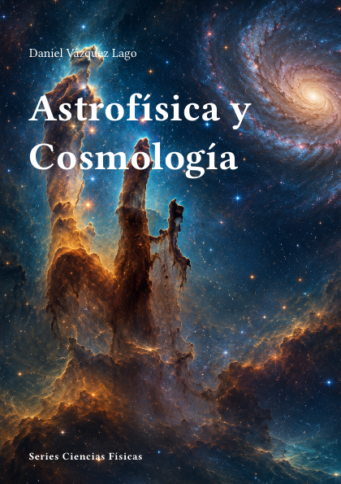

# Astrofísica y Cosmología



**Código:** `F-10` · **Estado:** 🟤 Esqueleto · **Progreso:** 3 %

Cuaderno organizado en 3 partes y 3 capítulos activos.

## Alcance

Incluye Astrofísica Nuclear, Nucleosíntesis Estelar y Primordial, Cosmología.

## Fuera de alcance

Pendiente de definir.

## Estructura

### Parte 1. Astrofísica Nuclear

- Introducción

### Parte 2. Nucleosíntesis Estelar y Primordial

- Introducción
- Nucleosíntesis en el Big Bang

### Parte 3. Cosmología

- Sin capítulos activos todavía.

## Estado editorial

| Dimensión | Progreso |
|---|---:|
| Texto | 2 % |
| Figuras | 0 % |
| Ejercicios | 0 % |
| Bibliografía | 17 % |
| Revisión | 5 % |
| **Global ponderado** | **3 %** |

Capítulos activos: **3** · Páginas compiladas: **17** · PDF: **actualizado**.

## Compilación

Desde la raíz del repositorio:

```bash
python -m cuadernos update F-10
```

Para regenerar todo el proyecto sin compilar:

```bash
python -m cuadernos update --no-build
```

## Archivos principales

- Manifiesto: `cuaderno.toml`
- Entrada Typst: `F-Astrofisica.typ`
- Contenido: `content.typ`
- Bibliografía: `Bibliografia/referencias.bib`
- PDF: `F-Astrofisica.pdf`

> Este README se genera automáticamente a partir del manifiesto y del contenido Typst.
