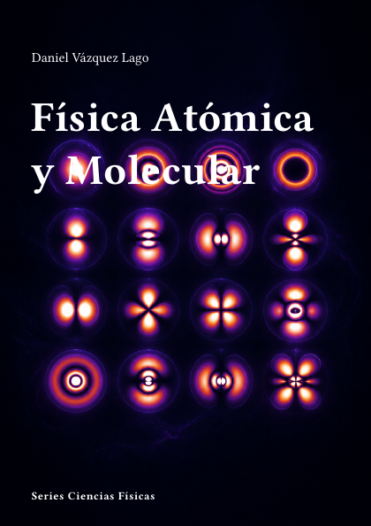

# Física Atómica y Molecular



**Código:** `F-05` · **Estado:** 🟤 Esqueleto · **Progreso:** 1 %

Esquema editorial organizado en 6 partes; el desarrollo del texto está en fase inicial.

## Alcance

Incluye Estructura atómica, Interacción radiación-materia, Física molecular, Espectroscopia, Colisiones y materia fría, Aplicaciones y métodos experimentales.

## Fuera de alcance

Pendiente de definir.

## Estructura

### Parte 1. Estructura atómica

- Átomo de hidrógeno
- Átomos multielectrónicos
- Acoplamiento angular
- Estructura fina e hiperfina

### Parte 2. Interacción radiación-materia

- Transiciones electromagnéticas
- Reglas de selección
- Átomo de dos niveles
- Campos intensos

### Parte 3. Física molecular

- Enlace molecular
- Rotaciones y vibraciones
- Estructura electrónica molecular
- Dinámica molecular

### Parte 4. Espectroscopia

- Espectroscopia atómica
- Espectroscopia molecular
- Resonancia magnética
- Técnicas ultrarrápidas

### Parte 5. Colisiones y materia fría

- Colisiones atómicas
- Átomos ultrafríos
- Condensados de Bose-Einstein
- Moléculas frías

### Parte 6. Aplicaciones y métodos experimentales

- Relojes atómicos
- Trampas y enfriamiento láser
- Metrología espectroscópica
- Astrofísica y diagnóstico de plasmas

## Estado editorial

| Dimensión | Progreso |
|---|---:|
| Texto | 0 % |
| Figuras | 0 % |
| Ejercicios | 0 % |
| Bibliografía | 0 % |
| Revisión | 5 % |
| **Global ponderado** | **1 %** |

Capítulos activos: **24** · Páginas compiladas: **63** · PDF: **actualizado**.

## Compilación

Desde la raíz del repositorio:

```bash
python -m cuadernos update F-05
```

Para regenerar todo el proyecto sin compilar:

```bash
python -m cuadernos update --no-build
```

## Archivos principales

- Manifiesto: `cuaderno.toml`
- Entrada Typst: `F-Atomica.typ`
- Contenido: `content.typ`
- Bibliografía: `Bibliografia/referencias.bib`
- PDF: `F-Atomica.pdf`

> Este README se genera automáticamente a partir del manifiesto y del contenido Typst.
