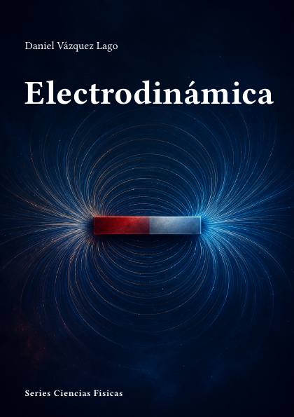

# Electrodinámica



**Código:** `F-02` · **Estado:** 🟤 Esqueleto · **Progreso:** 2 %

Cuaderno organizado en 5 partes y 16 capítulos activos.

## Alcance

Incluye Contenido, Electrostática, Magnetostática, Electrodinámica, Radiación.

## Fuera de alcance

Pendiente de definir.

## Estructura

### Parte 1. Contenido

- Análisis Vectorial

### Parte 2. Electrostática

- Electrostática
- Condiciones de frontera en Electrostática
- Campos eléctricos en medios materiales

### Parte 3. Magnetostática

- Magnetostática
- Campos magnéticos en medios materiales
- Materiaels Magnéticos

### Parte 4. Electrodinámica

- Electrodinámica
- Leyes de Conervación
- Ondas electromagnéticas
- Guidas de Ondas
- Relatividad especial
- Electrodinámica Relativista

### Parte 5. Radiación

- Sistemas Radiantes: multipolos
- Radiación de Partículas en Movimiento
- Colisiones entre partículas y pérdidas de energía

## Estado editorial

| Dimensión | Progreso |
|---|---:|
| Texto | 0 % |
| Figuras | 0 % |
| Ejercicios | 0 % |
| Bibliografía | 10 % |
| Revisión | 5 % |
| **Global ponderado** | **2 %** |

Capítulos activos: **16** · Páginas compiladas: **45** · PDF: **actualizado**.

## Compilación

Desde la raíz del repositorio:

```bash
python -m cuadernos update F-02
```

Para regenerar todo el proyecto sin compilar:

```bash
python -m cuadernos update --no-build
```

## Archivos principales

- Manifiesto: `cuaderno.toml`
- Entrada Typst: `F-Electrodinamica.typ`
- Contenido: `content.typ`
- Bibliografía: `Bibliografia/referencias.bib`
- PDF: `F-Electrodinamica.pdf`

> Este README se genera automáticamente a partir del manifiesto y del contenido Typst.
