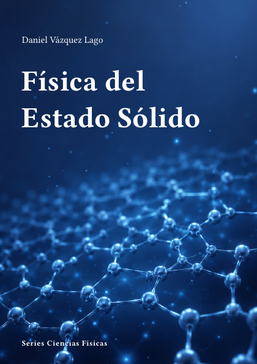

# Física del Estado Sólido



**Código:** `F-06` · **Estado:** 🟤 Esqueleto · **Progreso:** 1 %

Esquema editorial organizado en 7 partes; el desarrollo del texto está en fase inicial.

## Alcance

Incluye Estructura cristalina, Electrones en sólidos, Dinámica de la red, Transporte electrónico, Magnetismo, Superconductividad, Materia condensada avanzada.

## Fuera de alcance

Pendiente de definir.

## Estructura

### Parte 1. Estructura cristalina

- Redes y simetrías
- Difracción
- Defectos cristalinos
- Superficies e interfaces

### Parte 2. Electrones en sólidos

- Modelo de electrones libres
- Teorema de Bloch
- Bandas electrónicas
- Superficies de Fermi

### Parte 3. Dinámica de la red

- Fonones
- Capacidad calorífica
- Interacción electrón-fonón
- Transporte térmico

### Parte 4. Transporte electrónico

- Conductividad
- Efecto Hall
- Semimetales y aislantes
- Transporte mesoscópico

### Parte 5. Magnetismo

- Diamagnetismo y paramagnetismo
- Ferromagnetismo
- Antiferromagnetismo
- Espintrónica

### Parte 6. Superconductividad

- Fenomenología
- Teoría BCS
- Vórtices y superconductores tipo II
- Superconductividad no convencional

### Parte 7. Materia condensada avanzada

- Sistemas de baja dimensionalidad
- Fases topológicas
- Materia blanda
- Nanomateriales

## Estado editorial

| Dimensión | Progreso |
|---|---:|
| Texto | 0 % |
| Figuras | 0 % |
| Ejercicios | 0 % |
| Bibliografía | 0 % |
| Revisión | 5 % |
| **Global ponderado** | **1 %** |

Capítulos activos: **28** · Páginas compiladas: **73** · PDF: **actualizado**.

## Compilación

Desde la raíz del repositorio:

```bash
python -m cuadernos update F-06
```

Para regenerar todo el proyecto sin compilar:

```bash
python -m cuadernos update --no-build
```

## Archivos principales

- Manifiesto: `cuaderno.toml`
- Entrada Typst: `F-Estado_Solido.typ`
- Contenido: `content.typ`
- Bibliografía: `Bibliografia/referencias.bib`
- PDF: `F-Estado_Solido.pdf`

> Este README se genera automáticamente a partir del manifiesto y del contenido Typst.
