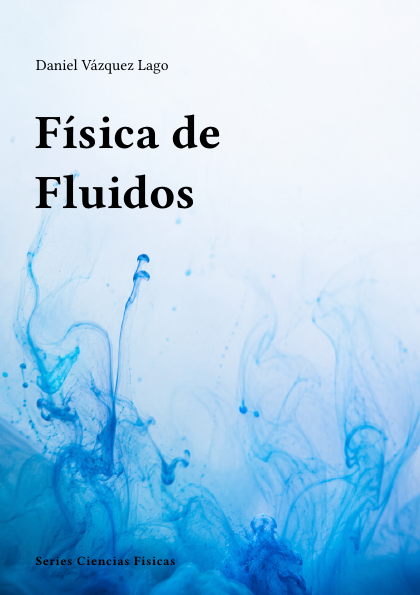

# Física de Fluidos



**Código:** `F-11` · **Estado:** 🟤 Esqueleto · **Progreso:** 1 %

Esquema editorial organizado en 7 partes; el desarrollo del texto está en fase inicial.

## Alcance

Incluye Fundamentos de medios continuos, Fluidos ideales, Fluidos viscosos, Capas límite y aerodinámica, Turbulencia, Flujos compresibles, Fluidos multifásicos y geofísicos.

## Fuera de alcance

Pendiente de definir.

## Estructura

### Parte 1. Fundamentos de medios continuos

- Cinemática de fluidos
- Conservación de masa
- Conservación de momento
- Conservación de energía

### Parte 2. Fluidos ideales

- Ecuaciones de Euler
- Bernoulli
- Flujo potencial
- Vorticidad

### Parte 3. Fluidos viscosos

- Navier-Stokes
- Flujo de Poiseuille
- Número de Reynolds
- Disipación

### Parte 4. Capas límite y aerodinámica

- Teoría de capa límite
- Separación
- Sustentación y resistencia
- Flujo alrededor de cuerpos

### Parte 5. Turbulencia

- Transición
- Cascada de energía
- Modelos estadísticos
- Simulación de turbulencia

### Parte 6. Flujos compresibles

- Ondas de choque
- Flujo supersónico
- Toberas
- Combustión

### Parte 7. Fluidos multifásicos y geofísicos

- Tensión superficial
- Burbujas y gotas
- Fluidos estratificados
- Atmósfera y océanos

## Estado editorial

| Dimensión | Progreso |
|---|---:|
| Texto | 0 % |
| Figuras | 0 % |
| Ejercicios | 0 % |
| Bibliografía | 0 % |
| Revisión | 5 % |
| **Global ponderado** | **1 %** |

Capítulos activos: **28** · Páginas compiladas: **73** · PDF: **actualizado**.

## Compilación

Desde la raíz del repositorio:

```bash
python -m cuadernos update F-11
```

Para regenerar todo el proyecto sin compilar:

```bash
python -m cuadernos update --no-build
```

## Archivos principales

- Manifiesto: `cuaderno.toml`
- Entrada Typst: `F-Fluidos.typ`
- Contenido: `content.typ`
- Bibliografía: `Bibliografia/referencias.bib`
- PDF: `F-Fluidos.pdf`

> Este README se genera automáticamente a partir del manifiesto y del contenido Typst.
