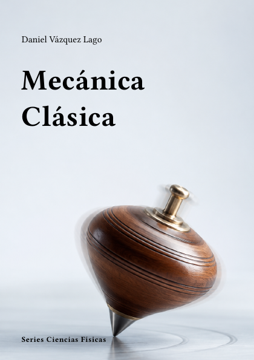

# Mecánica Clásica



**Código:** `F-01` · **Estado:** 🟤 Esqueleto · **Progreso:** 1 %

Esquema editorial organizado en 6 partes; el desarrollo del texto está en fase inicial.

## Alcance

Incluye Fundamentos de la mecánica, Mecánica analítica, Mecánica hamiltoniana, Sistemas de muchas partículas y sólidos rígidos, Oscilaciones, ondas y medios continuos, Dinámica no lineal y caos.

## Fuera de alcance

Pendiente de definir.

## Estructura

### Parte 1. Fundamentos de la mecánica

- Espacio, tiempo y cinemática
- Leyes de Newton y sistemas de referencia
- Conservación de energía, momento y momento angular

### Parte 2. Mecánica analítica

- Principio variacional
- Formalismo lagrangiano
- Restricciones y coordenadas generalizadas
- Simetrías y teorema de Noether

### Parte 3. Mecánica hamiltoniana

- Transformaciones canónicas
- Ecuaciones de Hamilton
- Hamilton-Jacobi
- Teoría canónica de perturbaciones

### Parte 4. Sistemas de muchas partículas y sólidos rígidos

- Centro de masas y colisiones
- Dinámica del sólido rígido
- Rotaciones y tensores de inercia

### Parte 5. Oscilaciones, ondas y medios continuos

- Pequeñas oscilaciones
- Modos normales
- Cuerdas, membranas y elasticidad
- Acústica

### Parte 6. Dinámica no lineal y caos

- Estabilidad y espacio de fases
- Bifurcaciones
- Caos determinista
- Sistemas hamiltonianos no integrables

## Estado editorial

| Dimensión | Progreso |
|---|---:|
| Texto | 0 % |
| Figuras | 0 % |
| Ejercicios | 0 % |
| Bibliografía | 0 % |
| Revisión | 5 % |
| **Global ponderado** | **1 %** |

Capítulos activos: **22** · Páginas compiladas: **59** · PDF: **actualizado**.

## Compilación

Desde la raíz del repositorio:

```bash
python -m cuadernos update F-01
```

Para regenerar todo el proyecto sin compilar:

```bash
python -m cuadernos update --no-build
```

## Archivos principales

- Manifiesto: `cuaderno.toml`
- Entrada Typst: `F-Mecanica_Clasica.typ`
- Contenido: `content.typ`
- Bibliografía: `Bibliografia/referencias.bib`
- PDF: `F-Mecanica_Clasica.pdf`

> Este README se genera automáticamente a partir del manifiesto y del contenido Typst.
