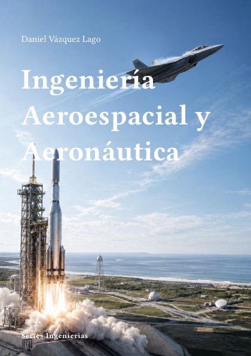

# Ingeniería Aeroespacial y Aeronáutica



**Código:** `I-06` · **Estado:** 🟤 Esqueleto · **Progreso:** 1 %

Esquema editorial organizado en 7 partes; el desarrollo del texto está en fase inicial.

## Alcance

Incluye Aerodinámica, Mecánica de vuelo, Propulsión, Estructuras y materiales, Aviónica y sistemas, Ingeniería espacial, Diseño y certificación.

## Fuera de alcance

Pendiente de definir.

## Estructura

### Parte 1. Aerodinámica

- Flujo potencial
- Perfiles y alas
- Flujo compresible
- Aerodinámica computacional

### Parte 2. Mecánica de vuelo

- Actuaciones
- Estabilidad
- Control de vuelo
- Navegación

### Parte 3. Propulsión

- Motores alternativos
- Turbinas de gas
- Cohetes
- Propulsión eléctrica

### Parte 4. Estructuras y materiales

- Estructuras aeronáuticas
- Materiales compuestos
- Fatiga
- Aeroelasticidad

### Parte 5. Aviónica y sistemas

- Sensores
- Comunicaciones
- Sistemas embarcados
- Fiabilidad

### Parte 6. Ingeniería espacial

- Mecánica orbital
- Vehículos espaciales
- Sistemas de misión
- Operaciones

### Parte 7. Diseño y certificación

- Diseño conceptual
- Optimización multidisciplinar
- Seguridad
- Certificación

## Estado editorial

| Dimensión | Progreso |
|---|---:|
| Texto | 0 % |
| Figuras | 0 % |
| Ejercicios | 0 % |
| Bibliografía | 0 % |
| Revisión | 5 % |
| **Global ponderado** | **1 %** |

Capítulos activos: **28** · Páginas compiladas: **73** · PDF: **actualizado**.

## Compilación

Desde la raíz del repositorio:

```bash
python -m cuadernos update I-06
```

Para regenerar todo el proyecto sin compilar:

```bash
python -m cuadernos update --no-build
```

## Archivos principales

- Manifiesto: `cuaderno.toml`
- Entrada Typst: `I-Aeroespacial.typ`
- Contenido: `content.typ`
- Bibliografía: `Bibliografia/referencias.bib`
- PDF: `I-Aeroespacial.pdf`

> Este README se genera automáticamente a partir del manifiesto y del contenido Typst.
