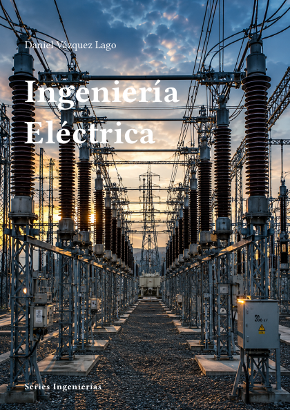

# Ingeniería Eléctrica



**Código:** `I-02` · **Estado:** 🟤 Esqueleto · **Progreso:** 1 %

Esquema editorial organizado en 6 partes; el desarrollo del texto está en fase inicial.

## Alcance

Incluye Circuitos y electromagnetismo, Máquinas eléctricas, Electrónica de potencia, Generación y redes, Alta tensión y protecciones, Sistemas eléctricos modernos.

## Fuera de alcance

Pendiente de definir.

## Estructura

### Parte 1. Circuitos y electromagnetismo

- Circuitos eléctricos
- Sistemas trifásicos
- Campos electromagnéticos
- Medidas eléctricas

### Parte 2. Máquinas eléctricas

- Transformadores
- Máquinas de corriente continua
- Máquinas síncronas
- Máquinas de inducción

### Parte 3. Electrónica de potencia

- Rectificadores
- Convertidores
- Inversores
- Accionamientos

### Parte 4. Generación y redes

- Generación convencional
- Renovables
- Flujo de carga
- Estabilidad

### Parte 5. Alta tensión y protecciones

- Aislamiento
- Sobretensiones
- Protecciones
- Puesta a tierra

### Parte 6. Sistemas eléctricos modernos

- Redes inteligentes
- Almacenamiento
- Microredes
- Movilidad eléctrica

## Estado editorial

| Dimensión | Progreso |
|---|---:|
| Texto | 0 % |
| Figuras | 0 % |
| Ejercicios | 0 % |
| Bibliografía | 0 % |
| Revisión | 5 % |
| **Global ponderado** | **1 %** |

Capítulos activos: **24** · Páginas compiladas: **63** · PDF: **actualizado**.

## Compilación

Desde la raíz del repositorio:

```bash
python -m cuadernos update I-02
```

Para regenerar todo el proyecto sin compilar:

```bash
python -m cuadernos update --no-build
```

## Archivos principales

- Manifiesto: `cuaderno.toml`
- Entrada Typst: `I-Electrica.typ`
- Contenido: `content.typ`
- Bibliografía: `Bibliografia/referencias.bib`
- PDF: `I-Electrica.pdf`

> Este README se genera automáticamente a partir del manifiesto y del contenido Typst.
