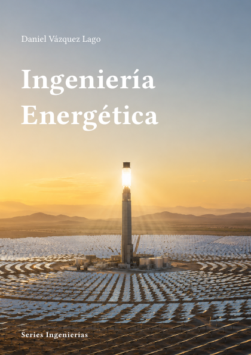

# Ingeniería Energética



**Código:** `I-09` · **Estado:** 🟤 Esqueleto · **Progreso:** 1 %

Esquema editorial organizado en 7 partes; el desarrollo del texto está en fase inicial.

## Alcance

Incluye Fundamentos energéticos, Sistemas térmicos, Energías renovables, Almacenamiento e hidrógeno, Sistemas eléctricos y redes, Energía nuclear, Eficiencia y ambiente.

## Fuera de alcance

Pendiente de definir.

## Estructura

### Parte 1. Fundamentos energéticos

- Balances y exergía
- Conversión de energía
- Recursos
- Demanda

### Parte 2. Sistemas térmicos

- Ciclos de potencia
- Turbinas
- Cogeneración
- Refrigeración

### Parte 3. Energías renovables

- Solar
- Eólica
- Hidráulica
- Bioenergía

### Parte 4. Almacenamiento e hidrógeno

- Baterías
- Almacenamiento térmico
- Hidrógeno
- Power-to-X

### Parte 5. Sistemas eléctricos y redes

- Integración renovable
- Redes
- Mercados
- Flexibilidad

### Parte 6. Energía nuclear

- Reactores
- Ciclo del combustible
- Seguridad
- Fusión

### Parte 7. Eficiencia y ambiente

- Eficiencia industrial
- Edificios
- Emisiones
- Análisis de ciclo de vida

## Estado editorial

| Dimensión | Progreso |
|---|---:|
| Texto | 0 % |
| Figuras | 0 % |
| Ejercicios | 0 % |
| Bibliografía | 0 % |
| Revisión | 5 % |
| **Global ponderado** | **1 %** |

Capítulos activos: **28** · Páginas compiladas: **73** · PDF: **actualizado**.

## Compilación

Desde la raíz del repositorio:

```bash
python -m cuadernos update I-09
```

Para regenerar todo el proyecto sin compilar:

```bash
python -m cuadernos update --no-build
```

## Archivos principales

- Manifiesto: `cuaderno.toml`
- Entrada Typst: `I-Energetica.typ`
- Contenido: `content.typ`
- Bibliografía: `Bibliografia/referencias.bib`
- PDF: `I-Energetica.pdf`

> Este README se genera automáticamente a partir del manifiesto y del contenido Typst.
