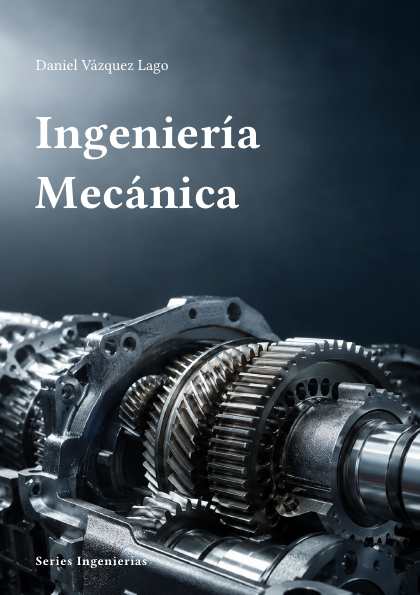

# Ingeniería Mecánica



**Código:** `I-01` · **Estado:** 🟤 Esqueleto · **Progreso:** 1 %

Esquema editorial organizado en 7 partes; el desarrollo del texto está en fase inicial.

## Alcance

Incluye Mecánica y materiales, Diseño mecánico, Máquinas y vibraciones, Sistemas térmicos y fluidos, Fabricación, Mecatrónica y control, Fiabilidad y proyecto.

## Fuera de alcance

Pendiente de definir.

## Estructura

### Parte 1. Mecánica y materiales

- Estática
- Dinámica
- Resistencia de materiales
- Selección de materiales

### Parte 2. Diseño mecánico

- Elementos de máquinas
- Fatiga
- Tribología
- Diseño asistido por ordenador

### Parte 3. Máquinas y vibraciones

- Mecanismos
- Dinámica de máquinas
- Vibraciones
- Mantenimiento

### Parte 4. Sistemas térmicos y fluidos

- Termodinámica aplicada
- Transferencia de calor
- Mecánica de fluidos
- Máquinas térmicas

### Parte 5. Fabricación

- Procesos de mecanizado
- Conformado
- Fabricación aditiva
- Metrología y calidad

### Parte 6. Mecatrónica y control

- Actuadores
- Sensores
- Control
- Robótica

### Parte 7. Fiabilidad y proyecto

- Fiabilidad
- Seguridad
- Gestión del ciclo de vida
- Proyecto mecánico

## Estado editorial

| Dimensión | Progreso |
|---|---:|
| Texto | 0 % |
| Figuras | 0 % |
| Ejercicios | 0 % |
| Bibliografía | 0 % |
| Revisión | 5 % |
| **Global ponderado** | **1 %** |

Capítulos activos: **28** · Páginas compiladas: **73** · PDF: **actualizado**.

## Compilación

Desde la raíz del repositorio:

```bash
python -m cuadernos update I-01
```

Para regenerar todo el proyecto sin compilar:

```bash
python -m cuadernos update --no-build
```

## Archivos principales

- Manifiesto: `cuaderno.toml`
- Entrada Typst: `I-Mecanica.typ`
- Contenido: `content.typ`
- Bibliografía: `Bibliografia/referencias.bib`
- PDF: `I-Mecanica.pdf`

> Este README se genera automáticamente a partir del manifiesto y del contenido Typst.
