# Nanotecnología e Ingeniería de Nanomateriales



**Código:** `I-14` · **Estado:** ⚪ Planificado · **Progreso:** 0 %

Cuaderno planificado con 6 partes previstas.

## Alcance

Incluirá Fundamentos de la nanoescala, Caracterización, Nanomateriales, Nanofabricación, Nanodispositivos, Aplicaciones, seguridad y regulación.

## Fuera de alcance

Pendiente de definir.

## Estructura

### Parte 1. Fundamentos de la nanoescala

- Sin capítulos activos todavía.

### Parte 2. Caracterización

- Sin capítulos activos todavía.

### Parte 3. Nanomateriales

- Sin capítulos activos todavía.

### Parte 4. Nanofabricación

- Sin capítulos activos todavía.

### Parte 5. Nanodispositivos

- Sin capítulos activos todavía.

### Parte 6. Aplicaciones, seguridad y regulación

- Sin capítulos activos todavía.

## Estado editorial

| Dimensión | Progreso |
|---|---:|
| Texto | 0 % |
| Figuras | 0 % |
| Ejercicios | 0 % |
| Bibliografía | 0 % |
| Revisión | 0 % |
| **Global ponderado** | **0 %** |

Capítulos activos: **0** · Páginas compiladas: **0** · PDF: **pendiente**.

## Compilación

Desde la raíz del repositorio:

```bash
python -m cuadernos update I-14
```

Para regenerar todo el proyecto sin compilar:

```bash
python -m cuadernos update --no-build
```

## Archivos principales

- Manifiesto: `cuaderno.toml`
- Entrada Typst: `pendiente`
- Contenido: `content.typ`
- Bibliografía: `Bibliografia/referencias.bib`
- PDF: `I-Nanotecnologia.pdf`

> Este README se genera automáticamente a partir del manifiesto y del contenido Typst.
