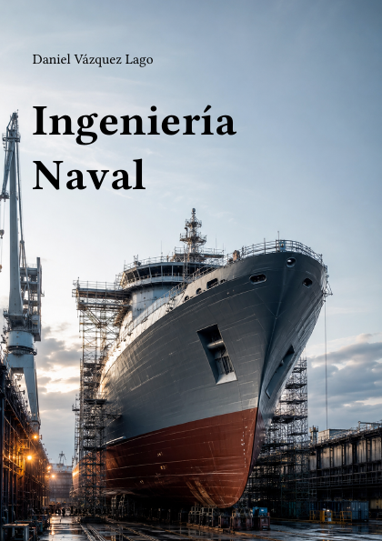

# Ingeniería Naval



**Código:** `I-08` · **Estado:** 🟤 Esqueleto · **Progreso:** 1 %

Esquema editorial organizado en 7 partes; el desarrollo del texto está en fase inicial.

## Alcance

Incluye Hidrostática y estabilidad, Hidrodinámica naval, Estructuras navales, Propulsión y energía, Sistemas del buque, Construcción y proyecto, Ingeniería oceánica.

## Fuera de alcance

Pendiente de definir.

## Estructura

### Parte 1. Hidrostática y estabilidad

- Geometría del buque
- Flotabilidad
- Estabilidad intacta
- Estabilidad averiada

### Parte 2. Hidrodinámica naval

- Resistencia
- Propulsión
- Maniobrabilidad
- Comportamiento en la mar

### Parte 3. Estructuras navales

- Cargas
- Dimensionamiento
- Fatiga
- Materiales y corrosión

### Parte 4. Propulsión y energía

- Motores marinos
- Hélices
- Propulsión eléctrica
- Eficiencia energética

### Parte 5. Sistemas del buque

- Sistemas auxiliares
- Electricidad y control
- Seguridad
- Habitabilidad

### Parte 6. Construcción y proyecto

- Astilleros
- Producción
- Reglamentación
- Diseño integrado

### Parte 7. Ingeniería oceánica

- Estructuras offshore
- Energías marinas
- Submarinos
- Operaciones marítimas

## Estado editorial

| Dimensión | Progreso |
|---|---:|
| Texto | 0 % |
| Figuras | 0 % |
| Ejercicios | 0 % |
| Bibliografía | 0 % |
| Revisión | 5 % |
| **Global ponderado** | **1 %** |

Capítulos activos: **28** · Páginas compiladas: **73** · PDF: **actualizado**.

## Compilación

Desde la raíz del repositorio:

```bash
python -m cuadernos update I-08
```

Para regenerar todo el proyecto sin compilar:

```bash
python -m cuadernos update --no-build
```

## Archivos principales

- Manifiesto: `cuaderno.toml`
- Entrada Typst: `I-Naval.typ`
- Contenido: `content.typ`
- Bibliografía: `Bibliografia/referencias.bib`
- PDF: `I-Naval.pdf`

> Este README se genera automáticamente a partir del manifiesto y del contenido Typst.
