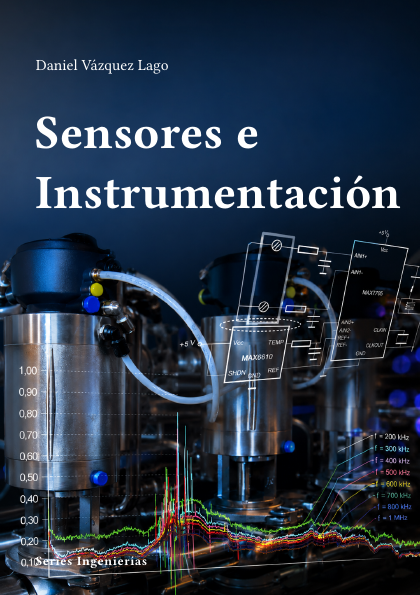

# Sensores e Instrumentación



**Código:** `I-04` · **Estado:** 🟤 Esqueleto · **Progreso:** 1 %

Esquema editorial organizado en 6 partes; el desarrollo del texto está en fase inicial.

## Alcance

Incluye Ciencia de la medida, Sensores físicos, Sensores químicos y biológicos, Acondicionamiento de señal, Adquisición e instrumentación, Integración y aplicaciones.

## Fuera de alcance

Pendiente de definir.

## Estructura

### Parte 1. Ciencia de la medida

- Magnitudes y unidades
- Trazabilidad
- Incertidumbre
- Calibración

### Parte 2. Sensores físicos

- Temperatura
- Presión y fuerza
- Posición y movimiento
- Ópticos y radiación

### Parte 3. Sensores químicos y biológicos

- Electroquímicos
- Gases
- Biosensores
- Microfluídica

### Parte 4. Acondicionamiento de señal

- Puentes y amplificación
- Filtrado
- Ruido
- Conversión A/D

### Parte 5. Adquisición e instrumentación

- DAQ
- Instrumentación virtual
- Sincronización
- Sistemas distribuidos

### Parte 6. Integración y aplicaciones

- Sensores inteligentes
- IoT industrial
- Instrumentación científica
- Diagnóstico y mantenimiento

## Estado editorial

| Dimensión | Progreso |
|---|---:|
| Texto | 0 % |
| Figuras | 0 % |
| Ejercicios | 0 % |
| Bibliografía | 0 % |
| Revisión | 5 % |
| **Global ponderado** | **1 %** |

Capítulos activos: **24** · Páginas compiladas: **63** · PDF: **actualizado**.

## Compilación

Desde la raíz del repositorio:

```bash
python -m cuadernos update I-04
```

Para regenerar todo el proyecto sin compilar:

```bash
python -m cuadernos update --no-build
```

## Archivos principales

- Manifiesto: `cuaderno.toml`
- Entrada Typst: `I-Sensores.typ`
- Contenido: `content.typ`
- Bibliografía: `Bibliografia/referencias.bib`
- PDF: `I-Sensores.pdf`

> Este README se genera automáticamente a partir del manifiesto y del contenido Typst.
