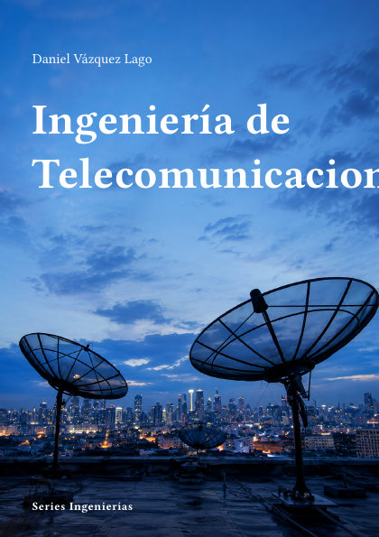

# Ingeniería de Telecomunicaciones



**Código:** `I-05` · **Estado:** 🟤 Esqueleto · **Progreso:** 1 %

Esquema editorial organizado en 7 partes; el desarrollo del texto está en fase inicial.

## Alcance

Incluye Señales y sistemas, Comunicaciones analógicas y digitales, Información y codificación, Radiofrecuencia y microondas, Antenas y propagación, Comunicaciones ópticas, Redes y sistemas modernos.

## Fuera de alcance

Pendiente de definir.

## Estructura

### Parte 1. Señales y sistemas

- Señales continuas y discretas
- Fourier y muestreo
- Filtrado
- Procesado digital

### Parte 2. Comunicaciones analógicas y digitales

- Modulación analógica
- Modulación digital
- Detección
- Sincronización

### Parte 3. Información y codificación

- Teoría de la información
- Códigos de canal
- Compresión
- Criptografía aplicada

### Parte 4. Radiofrecuencia y microondas

- Líneas de transmisión
- Circuitos RF
- Microondas
- Medidas

### Parte 5. Antenas y propagación

- Antenas
- Propagación terrestre
- Canales móviles
- Radar

### Parte 6. Comunicaciones ópticas

- Fibras
- Transmisores y receptores
- Redes ópticas
- Fotónica integrada

### Parte 7. Redes y sistemas modernos

- Internet
- Redes móviles
- 5G y 6G
- Comunicaciones satelitales

## Estado editorial

| Dimensión | Progreso |
|---|---:|
| Texto | 0 % |
| Figuras | 0 % |
| Ejercicios | 0 % |
| Bibliografía | 0 % |
| Revisión | 5 % |
| **Global ponderado** | **1 %** |

Capítulos activos: **28** · Páginas compiladas: **73** · PDF: **actualizado**.

## Compilación

Desde la raíz del repositorio:

```bash
python -m cuadernos update I-05
```

Para regenerar todo el proyecto sin compilar:

```bash
python -m cuadernos update --no-build
```

## Archivos principales

- Manifiesto: `cuaderno.toml`
- Entrada Typst: `I-Teleco.typ`
- Contenido: `content.typ`
- Bibliografía: `Bibliografia/referencias.bib`
- PDF: `I-Teleco.pdf`

> Este README se genera automáticamente a partir del manifiesto y del contenido Typst.
